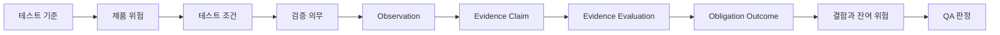

# Traceknot

<!-- readme-section:hero -->

<p align="center">
  
</p>

<p align="center"><strong>코딩 에이전트를 위한 감사 가능한 QA.</strong></p>

<p align="center">
  테스트 기준, 제품 위험, 실행 증거를 추적 가능한 결정론적 QA 판정으로 연결합니다.
</p>

<p align="center">
  <a href="README.md">English</a> ·
  <a href="README.ko.md">한국어</a> ·
  <a href="README.zh.md">简体中文</a>
</p>

<p align="center">
  <a href="https://github.com/Jin-Doh/traceknot/actions/workflows/ci.yml"></a>
  <a href="https://github.com/Jin-Doh/traceknot/releases"></a>
  <a href="LICENSE"></a>
</p>

<p align="center">
  <a href="https://traceknot.kyungho.info">웹사이트</a> ·
  <a href="BRAND.ko.md">브랜드 시스템</a>
</p>

Traceknot(트레이스노트)은 OMP, Codex, Claude Code, OpenCode, GajaeCode 같은 코딩 에이전트 하네스를 위한 ISTQB 기반 QA 프레임워크입니다. Portable Skill은 테스트 절차를 정의하고, 선택 사항인 호스트 중립 코어는 표준 기록을 검증해 판정을 계산합니다.

Traceknot은 에이전트를 조율하지 않습니다. 모델, 작업 그래프, 병렬 실행, 재시도, worktree, lifecycle, 최종 delivery는 하네스가 관리합니다. Traceknot이 맡는 것은 QA입니다. 무엇을 검증해야 하는지, 어떤 증거를 인정할지, 어떤 위험이 남았는지, 그 결과 어떤 판정을 내려야 하는지를 정의합니다.

Proof-carrying success는 네 층을 구분합니다. Observation은 사실을 기록하고, Evidence Claim은 그 사실이 의무를 어떻게 뒷받침하는지 해석하며, Evidence Evaluation은 claim을 채택하거나 기각하고, Obligation Outcome은 결과를 기록합니다. 대상 스냅샷에 결속된 채택된 긍정 증거만 필수 기준을 충족할 수 있습니다.

> `QA PASS`는 선언된 테스트 기준과 필수 검증 의무가 통과했다는 뜻입니다. 모든 에이전트, 작업, job 또는 delivery가 끝났다는 뜻은 아닙니다.

<!-- readme-section:quick-start -->

## 빠른 시작

Node.js 22.20 이상에서 portable Skill을 설치합니다.

<!-- shared-command:skill-install -->

```sh
npx skills add Jin-Doh/traceknot --skill traceknot --global
```

설치한 다음 코딩 에이전트에게 검증할 변경을 구체적으로 지정합니다.

```text
이 변경에 Traceknot을 적용해 검증해 줘. 테스트 기준, 위험,
필수 검증 의무, 관찰한 증거, 결함, 잔여 위험, 최종 QA 판정을
작업 완료 여부와 구분해서 보고해 줘.
```

Skill은 독립 실행형입니다. 선택 사항인 TypeScript 코어가 없어도 evidence-only workflow 전체를 실행할 수 있습니다.

<!-- readme-section:why -->

## Traceknot이 필요한 이유

코딩 에이전트 하네스는 이미 여러 활동 상태를 보고합니다. 활동이 있었다는 사실과 QA 판정은 다릅니다.

| 네이티브 신호 | 이 신호만으로는 알 수 없는 것 |
|---|---|
| 작업이나 에이전트가 멈춤 | 필수 검증이 통과했는지 |
| 명령이 성공으로 종료됨 | 테스트 기준과 위험 커버리지가 충분한지 |
| 에이전트가 완료를 보고함 | 증거가 최신이고 독립적이며 스냅샷에 결속됐는지 |
| 관찰한 job이 idle 상태가 됨 | 관찰하지 못한 작업까지 모두 끝났는지 |
| lifecycle hook이 실행됨 | 결정론적 QA 판정이나 완료 권한이 성립하는지 |

Traceknot은 이 사이에 빠진 테스트 절차를 제공합니다. 선언된 기준, 위험, 조건, 의무, 증거, 결함, 잔여 위험을 연결해 같은 입력에서 같은 판정이 나오도록 합니다.

<!-- readme-section:outputs -->

## 얻을 수 있는 결과

- 요구 사항, 계약, 저장소 정책, 인수 기준에서 도출한 테스트 기준
- 모든 실행에 적용하는 trigger scan과 위험할 때만 수행하는 bounded challenge
- 관찰 가능한 테스트 조건과 필수 검증 의무
- 대상 스냅샷, 생산자, 의무에 결속된 증거
- 서로 독립적으로 검사할 수 있는 proof-carrying observation, claim, evaluation, outcome
- 증거가 없을 때 PASS로 처리하지 않는 결함·잔여 위험 관리
- 명확한 우선순위에 따라 계산되는 결정론적 판정

완료 보고서는 다음과 같은 정보를 담습니다.

```text
Verdict             PASS_WITH_ACCEPTED_RISK
Snapshot            8f3c2a1
Mandatory checks    7 / 7 passed
Evidence            snapshot-bound
Residual risk       1 accepted, with owner and expiry
Harness authority   false
```

위 내용은 이해를 돕기 위한 예시입니다. 표준 JSON record나 실제 실행에서 관찰한 결과를 대신하지 않습니다.

<!-- readme-section:process -->

## 작동 방식



모든 실행은 최종 위험 등급을 정하기 전에 가벼운 trigger scan을 거칩니다. 변경의 위험이 크거나 범위가 불명확한 경우, 증거가 변경된 계약을 우회하는 경우, 반복 결함 군집과 겹치는 경우에만 bounded adversarial challenge를 수행합니다.

최종 판정은 다음 우선순위를 따릅니다.

```text
FAIL → BLOCKED → INCOMPLETE → PASS_WITH_ACCEPTED_RISK → PASS
```

구현 검증, 버그 수정 확인, 릴리스 점검, 저장소 감사, 증거 검토, 잔여 위험 판단에 Traceknot을 사용할 수 있습니다. 테스트 기법, discovery 규칙, 추적성 모델, 완료 보고 계약은 [QA 프로세스](docs/qa-process.md)에 정리돼 있습니다.

<!-- readme-section:status -->

## 지금 사용할 수 있는 기능

| 영역 | 상태와 경계 |
|---|---|
| Portable ISTQB 기반 Skill | **사용 가능.** Core에 의존하지 않는 evidence-only workflow |
| 표준 QA record schema | **사용 가능.** JSON Schema Draft 2020-12 폐쇄형 계약 |
| Proof-carrying evidence record | **사용 가능.** Observation, claim, evaluation, success criterion, traceability, verification run 계약 |
| 호스트 중립 verdict core | **사용 가능.** 항상 `authoritative: false` 출력 |
| Capability manifest | **사용 가능.** 정적 manifest는 보수적이며 runtime capability를 부여하지 않음 |
| 사용자 영역 전체 Toolkit installer와 updater | **사용 가능.** GitHub release artifact, digest, provenance 검증 |
| OMP, Codex, Claude Code, OpenCode, GajaeCode native adapter | **미구현.** 호스트 이름만으로 capability가 생기지 않음 |
| 하네스 완료 권한 | **기본 비활성.** 선택적 extension이며 `phase1Authorized: false` |
| npm package 또는 전용 Skill registry 등록 | **제공하지 않음.** Skills CLI의 GitHub 직접 설치는 사용 가능 |

Portable Skill과 호스트 중립 코어는 지금 사용할 수 있습니다. 하네스 완료를 확정할 권한은 별도 통합 과제로 남아 있습니다.

<!-- readme-section:install -->

## 설치 방법

### Portable Skill — 권장

빠른 시작 명령은 Skills CLI로 `skill/SKILL.md`와 참조 문서를 설치합니다. Codex에만 설치하려면 `--agent codex`를 추가하고, 현재 프로젝트 안에 설치하려면 `--global`을 생략합니다.

조회, 업데이트, 제거도 같은 CLI에서 처리합니다.

```sh
npx skills list --global
npx skills update traceknot --global --yes
npx skills remove traceknot --global --yes
```

### 전체 Toolkit — 고급

Skill과 함께 schema, capability manifest, 호스트 중립 코어, 검증된 release updater가 필요할 때 사용합니다.

<!-- shared-command:full-toolkit-install -->

```sh
curl -fsSL https://raw.githubusercontent.com/Jin-Doh/traceknot/main/install.sh | sh
```

통제된 환경에서는 실행 전에 스크립트를 검토하거나 고정 tag를 사용하세요. Installer는 `sudo` 없이 동작하고 `--dry-run`을 지원하며, 기본 경로는 `${XDG_DATA_HOME:-$HOME/.local/share}/traceknot`입니다.

Bootstrap 스크립트와 다운로드 payload를 같은 tag 또는 commit으로 함께 고정합니다.

<!-- shared-command:full-toolkit-pinned-install -->

```sh
TRACEKNOT_REF=<tag-or-commit>
curl -fsSL "https://raw.githubusercontent.com/Jin-Doh/traceknot/$TRACEKNOT_REF/install.sh" \
  | TRACEKNOT_REF="$TRACEKNOT_REF" sh
```

Skills CLI와 전체 Toolkit installer는 같은 사용자 영역 Skill 등록을 관리합니다. 설치 방식을 바꾸기 전에 기존 설치를 먼저 제거해야 합니다. 적용 조건, 검증, rollback, opt-out 정책은 [자동 업데이트 문서](docs/automatic-updates.md)를 참고하세요.

기본 경로의 전체 Toolkit은 다음 명령으로 제거합니다.

<!-- shared-command:full-toolkit-uninstall -->

```sh
curl -fsSL https://raw.githubusercontent.com/Jin-Doh/traceknot/main/uninstall.sh | sh
```

사용자 지정 설치 경로라면 `sh` 뒤에 `-s -- --prefix /absolute/path`를 붙입니다.

사용자 지정 Skills root도 사용했다면 installer에 지정했던 같은 값을 uninstaller에 전달합니다.

<!-- shared-command:full-toolkit-custom-uninstall -->

```sh
curl -fsSL https://raw.githubusercontent.com/Jin-Doh/traceknot/main/uninstall.sh \
  | TRACEKNOT_SKILLS_ROOT=/absolute/skills sh -s -- --prefix /absolute/path
```

활성 layout과 legacy layout의 경로 선택을 포함한 updater 실행 명령은 [자동 업데이트 문서](docs/automatic-updates.md)에 있습니다.

<!-- readme-section:documentation -->

## 문서

| 주제 | 문서 |
|---|---|
| 테스트 절차, 위험 탐색, 판정, 추적성 | [QA 프로세스](docs/qa-process.md) |
| Observation → Claim → Evaluation → Outcome 규범 의미 | [Proof-carrying success](skill/references/proof-carrying-success.md) |
| 구성 요소, 책임, adapter, 저장소 구조 | [아키텍처](docs/architecture.md) |
| 증거, capability, 권한, 보안 경계 | [Trust model](docs/trust-model.md) |
| 번역 책임과 동기화 규칙 | [다국어 문서 관리](docs/localization.md) |
| 전체 Toolkit updater 정책과 복구 | [자동 업데이트](docs/automatic-updates.md) |
| 보안 분석과 잔여 위험 | [보안 분석](docs/security-analysis.md) |
| 실행 가능한 portable workflow | [Skill 명세](skill/SKILL.md) |
| 이름, 목소리, 색상, artwork | [브랜드 시스템](BRAND.ko.md) |

<!-- readme-section:development -->

## 개발

Core 개발에는 Bun 1.3.14가 필요합니다. Lifecycle script를 실행하지 않고 검토된 dependency graph를 설치한 뒤 GitHub Actions와 같은 canonical gate를 실행합니다.

<!-- shared-command:ci -->

```sh
bun install --frozen-lockfile --ignore-scripts
bun run ci
```

이 gate는 installer lifecycle, schema, capability record, prompt-injection 위험, 게시 산문, 테스트, strict TypeScript, whitespace를 검증합니다. 한국어, 영어, 명시적으로 매핑한 간체 중국어 게시 산문의 advisory report는 `bun run prose-quality`로 확인할 수 있습니다.

보안 관련 finding에는 구체적인 예상 결과와 관찰 결과, 재현 방법, 대상 snapshot, 잔여 위험을 포함해야 합니다. 에이전트가 스스로 완료했다고 보고한 내용은 검증 증거로 취급하지 않습니다.

## 라이선스

Traceknot은 [MIT License](LICENSE)에 따라 배포됩니다.
