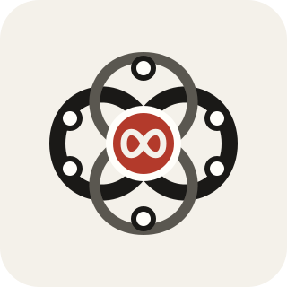
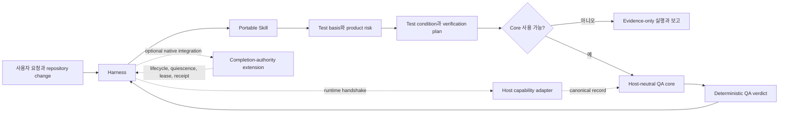
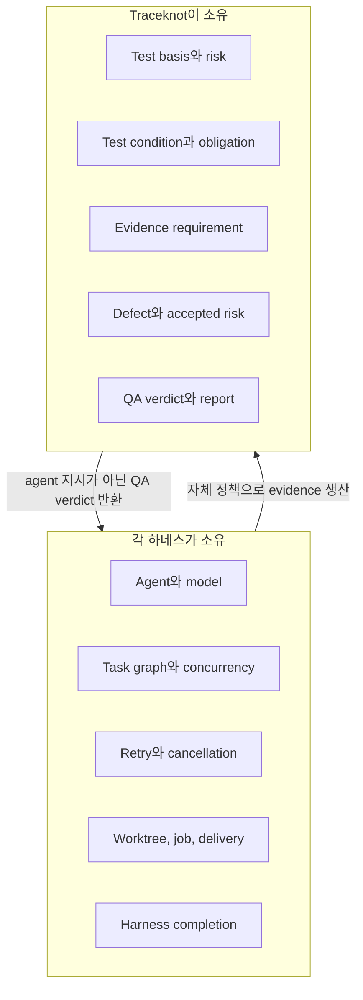

# Traceknot

<p align="center"></p>

**코딩 에이전트를 위한 증거 결속형 QA.**

[웹사이트](https://traceknot.kyungho.info) · [English documentation](README.md) · [브랜드 시스템](BRAND.ko.md)

Traceknot(트레이스노트)은 OMP, Codex, Claude Code, OpenCode, GajaeCode 같은 코딩 에이전트 하네스에서 사용할 수 있는 ISTQB 기반 QA 프레임워크입니다. 휴대형 테스트 절차, 결정론적 QA 판정, 선택적 하네스 완료 권한을 서로 분리합니다.

이 체계는 **서브에이전트를 관리하지 않습니다.** 에이전트, 모델, 작업 그래프, 병렬 실행, 재시도, 작업 트리, 수명 주기, 최종 작업 완료는 각 하네스가 관리합니다. Traceknot은 검증 대상, 인정할 증거, 결함과 잔여 위험의 처리 방식, QA 판정 규칙을 정의합니다.

> `QA PASS`는 선언된 test basis와 mandatory verification obligation이 통과했다는 뜻입니다. 모든 하네스 task, agent, job 또는 delivery가 완료됐다는 뜻이 아닙니다.

## Traceknot이 필요한 이유

코딩 에이전트 하네스는 이미 에이전트, 도구, job, retry, lifecycle event를 조정합니다. 이런 신호는 활동이 발생했음을 보여 주지만 선언된 변경이 충분히 검증되었음을 보장하지 않습니다.

| 네이티브 신호 | 보장하지 못하는 QA 속성 |
|---|---|
| turn, task, subagent 종료 | 필수 검증 통과 |
| 명령 성공 종료 | 테스트 기준과 위험 커버리지의 충분성 |
| 에이전트의 완료 보고 | 증거의 독립성, 최신성, 스냅샷 결속 |
| 관찰된 job의 idle 전환 | 전역 quiescence 또는 미관찰 작업의 부재 |
| hook 또는 app-server 이벤트 | 결정적 QA 판정 또는 완료 권한 |

Traceknot은 테스트 기준에서 판정까지의 추적성, 증거와 독립성 요건, 결함과 잔여 위험 처리, 판정 우선순위를 정의합니다. 각 판정은 선언한 증거에 연결되며, 수명 주기 이벤트만으로는 검증을 입증할 수 없습니다.

## 현재 상태

| 영역 | 상태 |
|---|---|
| Portable ISTQB 기반 Skill | 구현 완료 |
| Canonical QA record schema | 구현 및 schema 검증 완료 |
| Host-neutral deterministic verdict core | 구현 및 테스트 완료 |
| 하네스 capability manifest | 구현 완료; runtime capability 기본값은 없음 |
| Completion-authority 계약과 모델 | 선택적 extension으로 보존 |
| OMP/Codex/Claude/OpenCode native 연동 | 미구현 |
| Phase B completion enforcement | 미승인; `phase1Authorized: false` |
| 사용자 영역 installer와 uninstaller | 구현 완료; registry 배포와 public CLI는 미구현 |

휴대형 Skill과 호스트 중립 코어는 지금 평가와 개발에 사용할 수 있습니다. 하네스 완료를 확정할 권한은 별도의 후속 통합이 필요합니다.

## 게시 목적 산문 품질 게이트

Canonical gate는 설정된 한국어·영어 게시 산문에서 기계적으로 반복되는 구조, 과장된 상투구, 과도한 접속 표현 등 가독성 위험을 검사합니다. 작성자가 사람인지 AI인지를 판정하지 않습니다. Markdown frontmatter, 코드, 직접 인용, inline code, 링크와 URL은 문체 분석에서 제외합니다.

```sh
bun run prose-quality
```

`prose-quality.config.json`에서 게시 경로, 언어, 최소 산문 길이, advisory 또는 blocking 동작을 지정합니다. 저장소 기본값은 `advisory`입니다. 문체 finding은 보고하지만 작성 주체 판정으로 확대하지 않습니다. 별도의 before/after 모드는 윤문 과정에서 코드, 링크, URL, 수치, 의무 표현이 보존됐는지 확인합니다. 보호 내용이 바뀌거나 token 변경률이 50% 이상이면 실패합니다. 윤문 스킬은 remediation 수단이지 검증자가 아니므로, 결과를 새 snapshot에서 다시 검사해야 합니다.

한국어 규칙 범주와 보존 모델은 [epoko77-ai/im-not-ai](https://github.com/epoko77-ai/im-not-ai)를 참고했습니다. Traceknot은 독립적인 결정적 한·영 검사 경계를 구현하며, 외부 스킬의 자체 보고만으로 QA 증거를 충족하지 않습니다.

## 설치

저장소를 복제하지 않고 현재 `main` revision을 설치할 수 있습니다.

```sh
curl -fsSL https://raw.githubusercontent.com/Jin-Doh/traceknot/main/install.sh | sh
```

Script는 HTTPS로 같은 revision의 source archive를 내려받고 `sudo` 없이 설치합니다. 기본 설치 경로는 `${XDG_DATA_HOME:-$HOME/.local/share}/traceknot`이며, portable Skill은 OMP와 Codex가 검색하는 `$HOME/.agents/skills/traceknot`에 등록됩니다.

특정 tag나 commit을 고정하려면 script URL과 `TRACEKNOT_REF`에 같은 revision을 사용합니다.

```sh
TRACEKNOT_REF=<tag-or-commit>
curl -fsSL "https://raw.githubusercontent.com/Jin-Doh/traceknot/$TRACEKNOT_REF/install.sh" \
  | TRACEKNOT_REF="$TRACEKNOT_REF" sh
```

Installer는 portable Skill, record schema, capability manifest, host-neutral core, MIT 라이선스를 복사하고 공용 Agent Skills 디렉터리를 통해 OMP와 Codex에 Skill을 등록합니다. 선택 사항인 completion-authority extension은 설치하지 않습니다.

설치 경로를 바꾸려면 절대 경로를 지정합니다.

```sh
curl -fsSL https://raw.githubusercontent.com/Jin-Doh/traceknot/main/install.sh \
  | sh -s -- --prefix "$HOME/tools/traceknot"
```

같은 방식으로 `--dry-run`을 전달하면 복사 대상을 미리 확인할 수 있습니다. Installer를 다시 실행하면 Traceknot이 소유한 파일만 갱신하고 다른 파일은 건드리지 않습니다. 공용 Agent Skills 경로를 변경해야 할 때만 `TRACEKNOT_SKILLS_ROOT`에 절대 경로를 지정합니다.

실행 전에 script를 검토하려면 먼저 파일로 내려받거나 저장소를 복제해서 실행합니다.

```sh
git clone https://github.com/Jin-Doh/traceknot.git
cd traceknot
./install.sh
```

## 제거

기본 설치 경로에서 제거합니다.

```sh
curl -fsSL https://raw.githubusercontent.com/Jin-Doh/traceknot/main/uninstall.sh | sh
```

사용자 지정 경로에서 제거합니다.

```sh
curl -fsSL https://raw.githubusercontent.com/Jin-Doh/traceknot/main/uninstall.sh \
  | sh -s -- --prefix "$HOME/tools/traceknot"
```

Uninstaller는 설치 manifest를 읽어 Traceknot이 설치한 파일만 삭제하며, 공용 Skill 등록이 해당 설치를 계속 가리킬 때만 그 등록을 제거합니다. `--dry-run`으로 삭제 대상을 미리 확인할 수 있으며, 이미 제거된 상태에서 다시 실행해도 오류가 발생하지 않습니다. 설치 시 `TRACEKNOT_SKILLS_ROOT`를 지정했다면 제거 시에도 같은 값을 사용합니다. 저장소를 복제한 경우에는 `./uninstall.sh`를 사용할 수 있습니다.

## 자동 업데이트

자동 업데이트는 명시적으로 활성화해야 합니다. Updater는 서명된 provenance와 SHA-256 digest 검증을 통과한 immutable GitHub Release만 대상으로 하며, 동일 artifact를 처음 관찰한 뒤 7일이 완전히 지난 경우에만 설치 대상으로 판단합니다.

```sh
# 정책, schedule, 설치된 release 상태 확인
traceknot-update status

# 파일을 변경하지 않고 설치 가능한 release 확인
traceknot-update check

# 검증을 통과한 최신 release 적용
traceknot-update apply

# 하루 한 번 실행되는 자동 확인 활성화 또는 비활성화
traceknot-update enable
traceknot-update disable

# 직전 managed release로 복구
traceknot-update rollback
```

기본 경로가 아닌 곳에 설치했다면 `--prefix DIR`을 지정합니다. 설치 시 `install.sh --enable-auto-update`로 바로 활성화할 수 있지만, 설치 과정에서 update를 적용하지는 않습니다. 전체 정책, 복구 동작, release contract, 검증 근거는 [`docs/automatic-updates.md`](docs/automatic-updates.md)에 정리되어 있습니다.

## 아키텍처



### 책임 경계



Traceknot은 evidence requirement와 최소 independence 수준을 선언합니다. 특정 subagent 생성, 특정 모델 사용 또는 특정 병렬 정책을 하네스에 지시하지 않습니다.

## QA 프로세스

```mermaid
flowchart LR
    A[Test basis] --> B[Product risk]
    B --> C[Test condition]
    C --> D[Test technique]
    D --> E[Mandatory obligation]
    E --> F[Entry criteria]
    F --> G[실행과 evidence]
    G --> H[Defect와 regression]
    H --> I[Exit criteria]
    I --> J[Residual risk]
    J --> K[QA verdict]
```



Skill은 다음 7가지 테스트 원칙을 적용합니다.

1. 테스트는 defect의 존재를 보여주며 부재를 증명하지 않습니다.
2. Exhaustive testing은 불가능합니다.
3. Early testing은 비용과 지연을 줄입니다.
4. Defect는 특정 영역에 집중됩니다.
5. 같은 테스트를 반복하면 defect 탐지력이 약해집니다.
6. 테스트는 context dependent합니다.
7. 기술적 test suite가 녹색이어도 사용자와 비즈니스 요구를 충족하지 못하면 PASS가 아닙니다.

Traceability는 양방향입니다.

```text
test basis ↔ risk ↔ test condition ↔ obligation ↔ evidence ↔ defect
```

## Verdict 모델

| Verdict | 의미 |
|---|---|
| `PASS` | 모든 mandatory obligation과 required coverage가 통과했고, 수용되지 않은 material risk가 없습니다. |
| `PASS_WITH_ACCEPTED_RISK` | Mandatory obligation은 통과했고 남은 material risk가 모두 유효하고 만료되지 않은 승인을 보유합니다. |
| `FAIL` | Mandatory obligation이 실패했거나 수용되지 않은 material defect가 남아 있습니다. |
| `BLOCKED` | Mandatory prerequisite 또는 필요한 capability를 사용할 수 없습니다. |
| `INCOMPLETE` | Mandatory evidence 또는 required coverage에 terminal result가 없습니다. |

판정 우선순위는 결정적입니다.

```text
FAIL → BLOCKED → INCOMPLETE → PASS_WITH_ACCEPTED_RISK → PASS
```

Host-neutral core는 항상 `authoritative: false`를 출력합니다. 별도로 통합된 completion-authority extension만 하네스 수준의 권위를 주장할 수 있습니다.

## Repository 구조

```text
.
├── README.md
├── README.ko.md
├── install.sh
├── uninstall.sh
├── skill/
│   ├── SKILL.md
│   └── references/
├── contracts/
│   ├── capability.schema.json
│   ├── verification-request.schema.json
│   ├── verification-plan.schema.json
│   ├── evidence.schema.json
│   ├── defect.schema.json
│   └── verdict.schema.json
├── adapters/
│   ├── omp/
│   ├── codex/
│   ├── claude-code/
│   ├── opencode/
│   └── gajae-code/
└── system/
    ├── core/
    │   ├── qa-core.ts
    │   └── qa-core.test.ts
    └── extensions/
        └── harness-completion-authority/
            └── quality-contract/
```

### `skill/`

Portable host-neutral workflow입니다. Test basis, risk 분석, test design, entry/exit criteria, evidence, defect lifecycle, traceability, residual risk와 completion report를 다룹니다.

[skill/SKILL.md](skill/SKILL.md)에서 시작합니다. 상세 지침은 [skill/references](skill/references/)에 있습니다.

### `contracts/`

Skill, harness adapter, core validator 또는 외부 구현이 공유하는 closed JSON Schema Draft 2020-12 record입니다.

- host capability
- verification request
- verification plan
- evidence
- defect
- QA verdict

하네스 이름은 capability를 자동으로 부여하지 않습니다. Runtime handshake가 각 capability를 선언하고 증명해야 합니다.

### `adapters/`

지원 대상 하네스 이름에 대한 보수적인 capability manifest입니다. 모든 기본 capability는 `false`이며 accidental trust escalation을 방지합니다. 실제 adapter는 하네스의 agent policy를 인수하지 않고 현재 runtime capability와 evidence만 제공해야 합니다.

### `system/core/`

Host-neutral TypeScript verdict resolver입니다. 다음을 거부하거나 비통과 상태로 처리합니다.

- obligation 결과 중복
- 다른 snapshot의 evidence
- 요구 수준보다 낮은 producer independence
- evidence ID 없는 PASS
- 불완전한 traceability coverage
- 열린 material defect
- 만료된 risk acceptance

### Completion-authority extension

[system/extensions/harness-completion-authority](system/extensions/harness-completion-authority/)는 기존 lifecycle, quiescence, lease, receipt, terminal pair, SQLite, schema 및 generated evidence 계약을 보존합니다.

이 extension은 선택 사항이며 정책상 비활성화되어 있습니다. Task completion, subagent stop, turn completion 또는 agent end와 같은 lifecycle event는 observation일 뿐 독립적으로 completion을 seal하거나 verify할 수 없습니다.

## Portable Skill 사용

`install.sh`를 실행한 뒤 설치된 `skill/` 디렉터리를 하네스의 Skill loader에 연결합니다. Skill 자체는 `system/`에 runtime dependency가 없습니다.

예상 workflow:

1. target snapshot과 변경 범위를 식별합니다.
2. explicit/derived test-basis item을 수집합니다.
3. product risk를 분류합니다.
4. observable test condition과 expected result를 도출합니다.
5. test technique과 mandatory obligation을 선택합니다.
6. entry criteria를 확인합니다.
7. 하네스가 자체 orchestration 정책으로 검증을 실행합니다.
8. evidence와 defect를 기록합니다.
9. coverage, exit criteria와 residual risk를 평가합니다.
10. harness completion과 별도로 QA verdict를 발행합니다.

## Core 개발

요구 사항:

- Bun 1.3.14

검토된 도구 체인을 lifecycle script 없이 설치한 뒤 GitHub Actions와 동일한 필수 gate를 실행합니다.

```bash
bun install --frozen-lockfile --ignore-scripts
bun run ci
```

이 gate는 portable installer lifecycle, JSON 및 Draft 2020-12 schema 검증, capability 검증, prompt-injection 위험 분류, core test, strict typecheck, 공백 검사를 실행합니다. `high`와 `critical` prompt-risk finding은 gate를 차단합니다. 예외는 범위를 좁히고 만료일을 지정해야 하며, `security/prompt-injection-exceptions.json`에 owner, reason, mitigation, 정확한 line fingerprint를 기록해야 합니다.

개발 중 개별 core check를 실행하려면:

```bash
bun run test
bun run typecheck
```

## Completion-authority extension 검증

Extension root에서 실행합니다.

```bash
cd system/extensions/harness-completion-authority
bun quality-contract/scripts/verify-models.ts
bun quality-contract/scripts/verify-sqlite.ts
bun quality-contract/scripts/run-phase-b-verification.ts --intent
```

Preserved model strict typecheck:

```bash
bun x tsc --ignoreConfig --noEmit --strict \
  --target ES2022 --module ESNext --moduleResolution Bundler \
  quality-contract/models/lifecycle-model.ts \
  quality-contract/models/storage-model.ts \
  quality-contract/models/quiescence-budget-model.ts
```

현재 보존된 검증 evidence:

- model verifier: 570 passed, 0 failed
- explored model states: 6,304
- explored transitions: 27,152
- SQLite verifier: 138 passed, 0 failed
- Phase B intent: valid, `phase1Authorized: false`

## Security와 trust 모델

- 누락, 취소, timeout 또는 미완료 mandatory evidence는 PASS가 아닙니다.
- Evidence는 target snapshot과 obligation에 결속되어야 합니다.
- Required producer independence는 조용히 하향할 수 없습니다.
- Material risk acceptance에는 owner, reason, mitigation, expiry가 필요합니다.
- Host lifecycle notification 자체는 QA evidence가 아닙니다.
- Core는 global quiescence나 harness completion을 주장하지 않습니다.
- Completion-authority extension은 명시적인 native integration과 승인 절차 없이 활성화하면 안 됩니다.

## 준비도 평가

Portable Skill 평가와 host-neutral QA core 개발에는 **후속 과제 조건부 준비 완료** 상태입니다.

아직 준비되지 않은 영역:

- package manager 또는 Skill registry 배포
- OMP, Codex, Claude Code, OpenCode, GajaeCode native adapter
- authoritative harness completion
- production signing 또는 receipt authority

다음 delivery milestone은 evidence-only 기본값을 약화하지 않으면서 배포 metadata와 하나의 runtime adapter를 추가하는 것입니다.

## 라이선스

Traceknot은 [MIT License](LICENSE)에 따라 배포됩니다.
