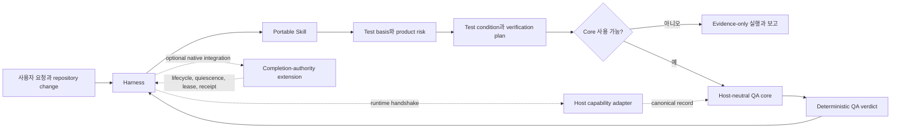
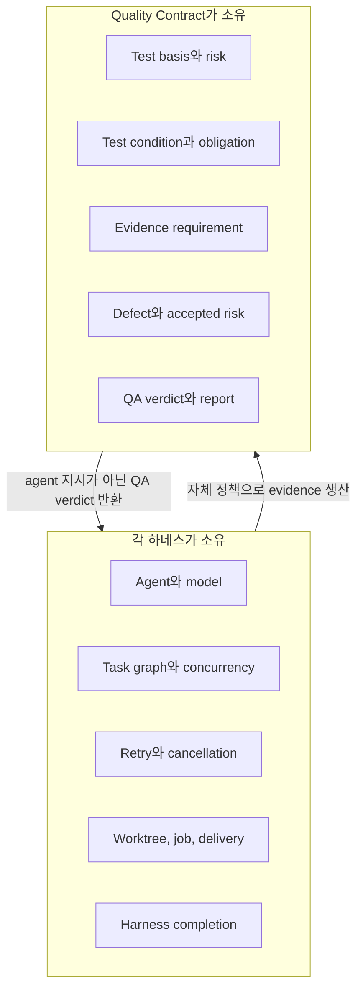

# Quality Contract

<p align="center"></p>

**코딩 에이전트를 위한 증거 결속형 QA.**

[English documentation](README.md) · [브랜드 시스템](BRAND.ko.md)

Quality Contract는 OMP, Codex, Claude Code, OpenCode, GajaeCode와 같은 코딩 에이전트 하네스에서 사용할 수 있는 ISTQB 기반 QA 체계입니다. 휴대 가능한 테스트 프로세스 지침, 결정론적 QA 판정, 선택적인 하네스 완료 권위를 서로 분리합니다.

이 체계는 **서브에이전트를 관리하지 않습니다.** 에이전트, 모델, task graph, 병렬성, retry, worktree, lifecycle과 최종 task 완료는 각 하네스가 소유합니다. Quality Contract는 무엇을 검증해야 하는지, 어떤 evidence를 인정할지, defect와 residual risk를 어떻게 처리할지, QA verdict를 어떻게 결정할지를 정의합니다.

> `QA PASS`는 선언된 test basis와 mandatory verification obligation이 통과했다는 뜻입니다. 모든 하네스 task, agent, job 또는 delivery가 완료됐다는 뜻이 아닙니다.

## Quality Contract가 필요한 이유

코딩 에이전트 하네스는 이미 에이전트, 도구, job, retry, lifecycle event를 조정합니다. 이런 신호는 활동이 발생했음을 보여 주지만 선언된 변경이 충분히 검증되었음을 보장하지 않습니다.

| 네이티브 신호 | 보장하지 못하는 QA 속성 |
|---|---|
| turn, task, subagent 종료 | 필수 검증 통과 |
| 명령 성공 종료 | 테스트 기준과 위험 커버리지의 충분성 |
| 에이전트의 완료 보고 | 증거의 독립성, 최신성, 스냅샷 결속 |
| 관찰된 job의 idle 전환 | 전역 quiescence 또는 미관찰 작업의 부재 |
| hook 또는 app-server 이벤트 | 결정적 QA 판정 또는 완료 권한 |

Quality Contract는 누락된 테스트 프로세스 계층을 제공합니다. 기준에서 판정까지의 추적성, 명시적 증거·독립성 요건, 결함·잔여 위험 처리, 결정적 판정 우선순위입니다. lifecycle event 자체는 증명이 아니라 관찰로 남습니다.

## 현재 상태

| 영역 | 상태 |
|---|---|
| Portable ISTQB 기반 Skill | 구현 완료 |
| Canonical QA record schema | 구현 및 schema 검증 완료 |
| Host-neutral deterministic verdict core | 구현 및 테스트 완료 |
| 하네스 capability manifest | 구현 완료; runtime capability 기본값은 없음 |
| Completion-authority 계약과 모델 | 선택적 extension으로 보존 |
| OMP/Codex/Claude/OpenCode native 연동 | 미구현 |
| Phase B completion enforcement | 미승인; `phase1Authorized: false` |
| Installer, registry 배포 및 public CLI | 미구현 |

Portable Skill과 host-neutral core는 현재 평가와 개발에 사용할 수 있습니다. Authoritative harness completion은 명시적으로 분리된 후속 integration 작업입니다.

## 아키텍처



### 책임 경계



Quality Contract는 evidence requirement와 최소 independence 수준을 선언합니다. 특정 subagent 생성, 특정 모델 사용 또는 특정 병렬 정책을 하네스에 지시하지 않습니다.

## QA 프로세스

```mermaid
flowchart LR
    A[Test basis] --> B[Product risk]
    B --> C[Test condition]
    C --> D[Test technique]
    D --> E[Mandatory obligation]
    E --> F[Entry criteria]
    F --> G[실행과 evidence]
    G --> H[Defect와 regression]
    H --> I[Exit criteria]
    I --> J[Residual risk]
    J --> K[QA verdict]
```



Skill은 다음 7가지 테스트 원칙을 적용합니다.

1. 테스트는 defect의 존재를 보여주며 부재를 증명하지 않습니다.
2. Exhaustive testing은 불가능합니다.
3. Early testing은 비용과 지연을 줄입니다.
4. Defect는 특정 영역에 집중됩니다.
5. 같은 테스트를 반복하면 defect 탐지력이 약해집니다.
6. 테스트는 context dependent합니다.
7. 기술적 test suite가 녹색이어도 사용자와 비즈니스 요구를 충족하지 못하면 PASS가 아닙니다.

Traceability는 양방향입니다.

```text
test basis ↔ risk ↔ test condition ↔ obligation ↔ evidence ↔ defect
```

## Verdict 모델

| Verdict | 의미 |
|---|---|
| `PASS` | 모든 mandatory obligation과 required coverage가 통과했고, 수용되지 않은 material risk가 없습니다. |
| `PASS_WITH_ACCEPTED_RISK` | Mandatory obligation은 통과했고 남은 material risk가 모두 유효하고 만료되지 않은 승인을 보유합니다. |
| `FAIL` | Mandatory obligation이 실패했거나 수용되지 않은 material defect가 남아 있습니다. |
| `BLOCKED` | Mandatory prerequisite 또는 필요한 capability를 사용할 수 없습니다. |
| `INCOMPLETE` | Mandatory evidence 또는 required coverage에 terminal result가 없습니다. |

판정 우선순위는 결정적입니다.

```text
FAIL → BLOCKED → INCOMPLETE → PASS_WITH_ACCEPTED_RISK → PASS
```

Host-neutral core는 항상 `authoritative: false`를 출력합니다. 별도로 통합된 completion-authority extension만 하네스 수준의 권위를 주장할 수 있습니다.

## Repository 구조

```text
.
├── README.md
├── README.ko.md
├── skill/
│   ├── SKILL.md
│   └── references/
├── contracts/
│   ├── capability.schema.json
│   ├── verification-request.schema.json
│   ├── verification-plan.schema.json
│   ├── evidence.schema.json
│   ├── defect.schema.json
│   └── verdict.schema.json
├── adapters/
│   ├── omp/
│   ├── codex/
│   ├── claude-code/
│   ├── opencode/
│   └── gajae-code/
└── system/
    ├── core/
    │   ├── qa-core.ts
    │   └── qa-core.test.ts
    └── extensions/
        └── harness-completion-authority/
            └── quality-contract/
```

### `skill/`

Portable host-neutral workflow입니다. Test basis, risk 분석, test design, entry/exit criteria, evidence, defect lifecycle, traceability, residual risk와 completion report를 다룹니다.

[skill/SKILL.md](skill/SKILL.md)에서 시작합니다. 상세 지침은 [skill/references](skill/references/)에 있습니다.

### `contracts/`

Skill, harness adapter, core validator 또는 외부 구현이 공유하는 closed JSON Schema Draft 2020-12 record입니다.

- host capability
- verification request
- verification plan
- evidence
- defect
- QA verdict

하네스 이름은 capability를 자동으로 부여하지 않습니다. Runtime handshake가 각 capability를 선언하고 증명해야 합니다.

### `adapters/`

지원 대상 하네스 이름에 대한 보수적인 capability manifest입니다. 모든 기본 capability는 `false`이며 accidental trust escalation을 방지합니다. 실제 adapter는 하네스의 agent policy를 인수하지 않고 현재 runtime capability와 evidence만 제공해야 합니다.

### `system/core/`

Host-neutral TypeScript verdict resolver입니다. 다음을 거부하거나 비통과 상태로 처리합니다.

- obligation 결과 중복
- 다른 snapshot의 evidence
- 요구 수준보다 낮은 producer independence
- evidence ID 없는 PASS
- 불완전한 traceability coverage
- 열린 material defect
- 만료된 risk acceptance

### Completion-authority extension

[system/extensions/harness-completion-authority](system/extensions/harness-completion-authority/)는 기존 lifecycle, quiescence, lease, receipt, terminal pair, SQLite, schema 및 generated evidence 계약을 보존합니다.

이 extension은 선택 사항이며 정책상 비활성화되어 있습니다. Task completion, subagent stop, turn completion 또는 agent end와 같은 lifecycle event는 observation일 뿐 독립적으로 completion을 seal하거나 verify할 수 없습니다.

## Portable Skill 사용

하네스가 제공하는 Skill 설치 방식으로 `skill/` 내용을 설치하거나 노출합니다. Skill 자체는 `system/`에 runtime dependency가 없습니다.

예상 workflow:

1. target snapshot과 변경 범위를 식별합니다.
2. explicit/derived test-basis item을 수집합니다.
3. product risk를 분류합니다.
4. observable test condition과 expected result를 도출합니다.
5. test technique과 mandatory obligation을 선택합니다.
6. entry criteria를 확인합니다.
7. 하네스가 자체 orchestration 정책으로 검증을 실행합니다.
8. evidence와 defect를 기록합니다.
9. coverage, exit criteria와 residual risk를 평가합니다.
10. harness completion과 별도로 QA verdict를 발행합니다.

## Core 개발

요구 사항:

- Bun
- `bun x tsc`로 접근 가능한 TypeScript

Host-neutral core 테스트:

```bash
bun test system/core/qa-core.test.ts
```

Strict typecheck:

```bash
bun x tsc --ignoreConfig --noEmit --strict \
  --target ES2022 --module ESNext --moduleResolution Bundler \
  system/core/qa-core.ts
```

Canonical schema 검증:

```bash
bunx ajv-cli@5 compile --spec=draft2020 \
  -s 'contracts/*.schema.json'
```

Capability record 검증:

```bash
bunx ajv-cli@5 validate --spec=draft2020 \
  -s contracts/capability.schema.json \
  -d 'adapters/*/capability.json'
```

## Completion-authority extension 검증

Extension root에서 실행합니다.

```bash
cd system/extensions/harness-completion-authority
bun quality-contract/scripts/verify-models.ts
bun quality-contract/scripts/verify-sqlite.ts
bun quality-contract/scripts/run-phase-b-verification.ts --intent
```

Preserved model strict typecheck:

```bash
bun x tsc --ignoreConfig --noEmit --strict \
  --target ES2022 --module ESNext --moduleResolution Bundler \
  quality-contract/models/lifecycle-model.ts \
  quality-contract/models/storage-model.ts \
  quality-contract/models/quiescence-budget-model.ts
```

현재 보존된 검증 evidence:

- model verifier: 570 passed, 0 failed
- explored model states: 6,304
- explored transitions: 27,152
- SQLite verifier: 138 passed, 0 failed
- Phase B intent: valid, `phase1Authorized: false`

## Security와 trust 모델

- 누락, 취소, timeout 또는 미완료 mandatory evidence는 PASS가 아닙니다.
- Evidence는 target snapshot과 obligation에 결속되어야 합니다.
- Required producer independence는 조용히 하향할 수 없습니다.
- Material risk acceptance에는 owner, reason, mitigation, expiry가 필요합니다.
- Host lifecycle notification 자체는 QA evidence가 아닙니다.
- Core는 global quiescence나 harness completion을 주장하지 않습니다.
- Completion-authority extension은 명시적인 native integration과 승인 절차 없이 활성화하면 안 됩니다.

## 준비도 평가

Portable Skill 평가와 host-neutral QA core 개발에는 **후속 과제 조건부 준비 완료** 상태입니다.

아직 준비되지 않은 영역:

- package manager 또는 Skill registry 배포
- one-command 설치
- OMP, Codex, Claude Code, OpenCode, GajaeCode native adapter
- authoritative harness completion
- production signing 또는 receipt authority

다음 delivery milestone은 evidence-only 기본값을 약화하지 않으면서 배포 metadata와 하나의 runtime adapter를 추가하는 것입니다.
