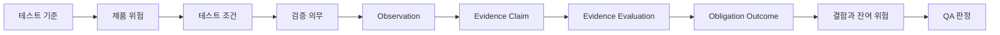

# Traceknot

<!-- readme-section:hero -->

<p align="center">
  
</p>

<p align="center"><strong>코딩 에이전트를 위한 감사 가능한 QA.</strong></p>

<p align="center">
  테스트 기준, 제품 위험, 실행 증거를 추적 가능한 결정론적 QA 판정으로 연결합니다.
</p>

<p align="center">
  <a href="README.md">English</a> ·
  <a href="README.ko.md">한국어</a> ·
  <a href="README.zh.md">简体中文</a>
</p>

<p align="center">
  <a href="https://github.com/Jin-Doh/traceknot/actions/workflows/ci.yml"></a>
  <a href="https://github.com/Jin-Doh/traceknot/releases"></a>
  <a href="https://www.skills.sh/jin-doh/traceknot/traceknot"></a>
  <a href="LICENSE"></a>
</p>

<p align="center">
  <a href="https://traceknot.kyungho.info">웹사이트</a> ·
  <a href="BRAND.ko.md">브랜드 시스템</a> ·
  <a href="https://github.com/Jin-Doh/traceknot">GitHub에서 Star</a>
</p>

Traceknot(트레이스노트)은 OMP, Codex, Claude Code, OpenCode, GajaeCode 같은 코딩 에이전트 하네스를 위한 ISTQB 기반 QA 프레임워크입니다. 정식 Skill bundle에는 테스트 절차, 생성된 `traceknot` CLI, 공통 Board renderer가 들어 있으며 호스트 중립 코어는 표준 기록을 검증해 판정을 계산합니다.

Traceknot은 에이전트를 조율하지 않습니다. 모델, 작업 그래프, 병렬 실행, 재시도, worktree, lifecycle, 최종 delivery는 하네스가 관리합니다. Traceknot이 맡는 것은 QA입니다. 무엇을 검증해야 하는지, 어떤 증거를 인정할지, 어떤 위험이 남았는지, 그 결과 어떤 판정을 내려야 하는지를 정의합니다.

Proof-carrying success는 네 층을 구분합니다. Observation은 사실을 기록하고, Evidence Claim은 그 사실이 의무를 어떻게 뒷받침하는지 해석하며, Evidence Evaluation은 claim을 채택하거나 기각하고, Obligation Outcome은 결과를 기록합니다. 대상 스냅샷에 결속된 채택된 긍정 증거만 필수 기준을 충족할 수 있습니다.

> `QA PASS`는 선언된 테스트 기준과 필수 검증 의무가 통과했다는 뜻입니다. 모든 에이전트, 작업, job 또는 delivery가 끝났다는 뜻은 아닙니다.

<!-- readme-section:quick-start -->

## 빠른 시작

Node.js 22.20 이상과 Bun 1.3.14 이상에서 정식 Skill bundle을 설치합니다. 생성된 CLI를 실행하려면 Bun이 필요합니다.

<!-- shared-command:skill-install -->

```sh
npx skills add Jin-Doh/traceknot --skill traceknot --global
```

설치한 다음 코딩 에이전트에게 검증할 변경을 구체적으로 지정합니다.

```text
이 변경에 Traceknot을 적용해 검증해 줘. 테스트 기준, 위험,
필수 검증 의무, 관찰한 증거, 결함, 잔여 위험, 최종 QA 판정을
작업 완료 여부와 구분해서 보고해 줘.
```

Skill bundle은 macOS와 `libc.so.6`를 제공하는 glibc 기반 Linux의 문서화된 workflow에 필요한 내용을 자체 포함합니다. 저장소의 `bin/traceknot`에서 생성된 `skill/bin/traceknot`와 참조 문서를 포함하므로 Bun과 플랫폼 C library 외에 별도 Traceknot runtime 설치가 필요하지 않습니다. Native Windows와 musl-only Linux는 local artifact store와 command collector가 지원하지 않으며, native library를 사용할 수 없으면 `traceknot self-check`가 fail-closed로 종료됩니다.

<!-- readme-section:why -->

## Traceknot이 필요한 이유

코딩 에이전트 하네스는 이미 여러 활동 상태를 보고합니다. 활동이 있었다는 사실과 QA 판정은 다릅니다.

| 네이티브 신호 | 이 신호만으로는 알 수 없는 것 |
|---|---|
| 작업이나 에이전트가 멈춤 | 필수 검증이 통과했는지 |
| 명령이 성공으로 종료됨 | 테스트 기준과 위험 커버리지가 충분한지 |
| 에이전트가 완료를 보고함 | 증거가 최신이고 독립적이며 스냅샷에 결속됐는지 |
| 관찰한 job이 idle 상태가 됨 | 관찰하지 못한 작업까지 모두 끝났는지 |
| lifecycle hook이 실행됨 | 결정론적 QA 판정이나 완료 권한이 성립하는지 |

Traceknot은 이 사이에 빠진 테스트 절차를 제공합니다. 선언된 기준, 위험, 조건, 의무, 증거, 결함, 잔여 위험을 연결해 같은 입력에서 같은 판정이 나오도록 합니다.

<!-- readme-section:outputs -->

## 얻을 수 있는 결과

- 요구 사항, 계약, 저장소 정책, 인수 기준에서 도출한 테스트 기준
- 모든 실행에 적용하는 trigger scan과 위험할 때만 수행하는 bounded challenge
- 관찰 가능한 테스트 조건과 필수 검증 의무
- 대상 스냅샷, 생산자, 의무에 결속된 증거
- 서로 독립적으로 검사할 수 있는 proof-carrying observation, claim, evaluation, outcome
- 증거가 없을 때 PASS로 처리하지 않는 결함·잔여 위험 관리
- 명확한 우선순위에 따라 계산되는 결정론적 판정

완료 보고서는 다음과 같은 정보를 담습니다.

```text
Verdict             PASS_WITH_ACCEPTED_RISK
Snapshot            8f3c2a1
Mandatory checks    7 / 7 passed
Evidence            snapshot-bound
Residual risk       1 accepted, with owner and expiry
Harness authority   false
```

위 내용은 이해를 돕기 위한 예시입니다. 표준 JSON record나 실제 실행에서 관찰한 결과를 대신하지 않습니다.

<!-- readme-section:process -->

## 작동 방식



모든 실행은 최종 위험 등급을 정하기 전에 가벼운 trigger scan을 거칩니다. 변경의 위험이 크거나 범위가 불명확한 경우, 증거가 변경된 계약을 우회하는 경우, 반복 결함 군집과 겹치는 경우에만 bounded adversarial challenge를 수행합니다.

최종 판정은 다음 우선순위를 따릅니다.

```text
FAIL → BLOCKED → INCOMPLETE → PASS_WITH_ACCEPTED_RISK → PASS
```

구현 검증, 버그 수정 확인, 릴리스 점검, 저장소 감사, 증거 검토, 잔여 위험 판단에 Traceknot을 사용할 수 있습니다. 테스트 기법, discovery 규칙, 추적성 모델, 완료 보고 계약은 [QA 프로세스](docs/qa-process.md)에 정리돼 있습니다.

<!-- readme-section:status -->

## 지금 사용할 수 있는 기능

| 영역 | 상태와 경계 |
|---|---|
| 정식 ISTQB 기반 Skill bundle | **사용 가능.** evidence-only workflow, 생성된 `skill/bin/traceknot` CLI, Board renderer 포함 |
| 표준 QA record schema | **사용 가능.** JSON Schema Draft 2020-12 폐쇄형 계약 |
| Proof-carrying evidence record | **사용 가능.** Observation, claim, evaluation, success criterion, traceability, verification run 계약 |
| 호스트 중립 verdict core | **사용 가능.** 항상 `authoritative: false` 출력 |
| 공통 capability model과 manifest | **사용 가능.** 하나의 닫힌 9-field model이 v2 manifest와 runtime discovery를 함께 규율하며, 정적 host 이름은 capability를 부여하지 않음 |
| 정식 session QA Board | **사용 가능.** `$HOME/.agents/skills/traceknot/bin/traceknot board update`가 immutable session revision과 stable `index.html`/`manifest.json`/`current.json`을 발행하고 보존 정책을 적용 |
| Skills CLI 설치 및 업데이트 | **사용 가능.** `npx skills add Jin-Doh/traceknot --skill traceknot`와 `npx skills update traceknot`가 동일한 완전한 Skill payload를 복사 |
| 선택적 legacy launcher/bootstrap | **사용 가능.** 필요한 환경을 위한 curl entrypoint이며 별도 feature tier가 아님 |
| 재사용 가능한 governed GitHub Action | **사용 가능.** 분리된 lifecycle/verdict check, fail-closed required 집계, canonical artifact 보존, job summary, 선택적 SARIF 업로드 |
| 결정론적 1.0 release benchmark | **사용 가능.** Proof verdict, cache boundary·integrity, unavailable usage 정직성을 오차 없이 hard gate로 검증하며 provider 효율 증거로 사용하지 않습니다 |
| OMP, Codex, Claude Code, OpenCode, GajaeCode native adapter | **미구현.** Codex와 Claude Code capability envelope 검증 primitive는 제공하지만 native transport나 invocation은 제공하지 않음. 호스트 이름만으로 capability가 생기지 않음 |
| 하네스 완료 권한 | **기본 비활성.** 선택적 extension이며 `phase1Authorized: false` |
| npm package 또는 전용 Skill registry 등록 | **제공하지 않음.** Skills CLI의 GitHub 직접 설치는 사용 가능 |

정식 Skill bundle과 호스트 중립 코어는 지금 사용할 수 있습니다. 하네스 완료를 확정할 권한은 별도 통합 과제로 남아 있습니다.

<!-- readme-capability:verify -->

## Verify CLI

Verify CLI는 검증된 명시적 명령 manifest를 로컬 collector로 실행하고 VerificationRun checkpoint를 원자적으로 저장합니다. 설치 범위와 같은 실행 파일을 사용해야 하며, 프로젝트 로컬 설치가 관련 없는 전역 실행 파일로 fallback하면 안 됩니다. 실행 상태와 content-addressed artifact는 기본적으로 저장소 밖의 사용자 cache에 저장되므로 검증 중인 Git snapshot을 바꾸지 않습니다.

```sh
# 전역 설치
$HOME/.agents/skills/traceknot/bin/traceknot verify --request request.json --manifest manifest.json --root .
# 프로젝트 로컬 설치
.agents/skills/traceknot/bin/traceknot verify --request request.json --manifest manifest.json --root .
```

요청은 현재 Git의 `rootIdentity`와 `snapshotId`를 지정해야 하며, 두 필드 모두 리터럴 `auto`를 사용할 수 있습니다. `verification-manifest/v1` manifest는 생성된 각 obligation에 절대 경로 executable과 argument 배열, 절대 경로 `executionCompletionPath`, 또는 둘 다를 연결합니다. Shell 문자열 보간은 거부됩니다.

CLI의 로컬 collector는 하네스가 관리하는 별도 검증 컨텍스트(`separate-verification-context`) producer입니다. 자체 명령 결과나 호출자가 제공한 oracle 파일에 `independent-producer` 출처를 부여하지 않습니다. 따라서 R3, visual-composition, UI-resilience 또는 profile이 독립 증거를 요구하는 obligation은 이러한 입력만으로 통과할 수 없습니다.

Visual-composition obligation에는 절대 경로 `visualCompositionOraclePath`를 지정하고, 각 screenshot, design-token-resolution 또는 approved-visual-reference artifact의 원래 `type`, `digest`, `path`를 선언해야 합니다. CLI는 oracle을 검증하고 선언된 artifact를 안전하게 수집하며 증거 유형을 보존합니다. Screenshot 증거는 디코딩 가능한 PNG여야 합니다. Whole-page 크기는 capture viewport와 device-pixel ratio에 맞아야 하고, focused-region 크기는 연결된 measured region을 포함해야 합니다.

UI content-resilience obligation에는 절대 경로 `uiResilienceOraclePath`를 지정합니다. Screenshot, `ui-applicability-approval`, `ui-full-text-access`, `ui-visual-review-approval-receipt` artifact의 원래 type, digest, path를 선언해야 합니다. 요청의 surface capability inventory가 필수 profile을 결정하며, 적용하지 않는 profile마다 저장된 승인 artifact가 필요합니다. Paint 단계의 사람 검토는 독립적으로 인증된 receipt가 있어야 `PASS`에 기여할 수 있습니다.

독립 producer는 obligation의 절대 경로 `executionCompletionPath`를 통해 `verification-execution-completion/v1` envelope를 반환할 수 있습니다. Envelope는 정확한 request, plan, obligation, snapshot, idempotency key, output, artifact, oracle digest에 결합되어야 합니다. 서명된 각 artifact는 `executionCompletionArtifacts`에 type, digest, Git root 밖의 절대 handoff 경로와 함께 한 번씩 선언합니다. Traceknot은 서명된 artifact 집합을 먼저 인증한 뒤 해당 byte를 안전하게 읽고 hash를 검증해 새로운 artifact store에 게시합니다. Envelope는 root 소유의 `/etc/traceknot/trusted-producer.json` 정책(`trusted-producer-policy/v1`)에 대해 Ed25519 서명이 검증될 때만 허용됩니다. 정책은 일반 파일이어야 하며 group 또는 world 쓰기 권한이 없어야 합니다. 잘못되었거나 대체되었거나 서명되지 않았거나 신뢰할 수 없거나 byte가 없거나 digest가 일치하지 않는 입력은 fail-closed로 처리되며, 호출자가 작성한 독립 출처로 fallback하지 않습니다.

기본 출력은 기계 판독용 JSON입니다. 사람이 읽는 보고서는 `--format markdown`, 명령을 다시 실행하지 않고 terminal run을 읽으려면 `--report-only --run-id ID`를 사용합니다. Exit code는 `PASS` 또는 `PASS_WITH_ACCEPTED_RISK`일 때 `0`, `FAIL`은 `1`, `BLOCKED`는 `2`, `INCOMPLETE`는 `3`, 잘못된 입력은 `64`, 내부 오류는 `70`입니다.

<!-- readme-section:install -->

## 설치 방법

### Skills CLI — 정식 설치 경로

빠른 시작 명령은 `SKILL.md`, 참조 문서, 실행 파일 `skill/bin/traceknot`를 포함한 완전한 `skill/` tree를 Skills CLI로 설치합니다. 생성된 CLI에는 Bun 1.3.14 이상이 필요합니다. Codex에만 설치하려면 `--agent codex`를 추가하고, 현재 프로젝트 안에 설치하려면 `--global`을 생략합니다.

```sh
npx skills add Jin-Doh/traceknot --skill traceknot --global
```

같은 완전한 payload를 다음 CLI로 관리합니다.

```sh
npx skills list --global
npx skills update traceknot --global --yes
npx skills remove traceknot --global --yes
```

프로젝트 로컬 설치는 프로젝트 루트에서 `npx skills update traceknot --yes`와 `npx skills remove traceknot --yes`를 실행하며 `--global`을 사용하지 않습니다.

전역 Skills CLI 설치는 `$HOME/.agents/skills/traceknot/bin/traceknot`으로 실행하고, 프로젝트 로컬 설치는 프로젝트 루트에서 `.agents/skills/traceknot/bin/traceknot`을 실행합니다. 전역 설치나 업데이트 후에는 `$HOME/.agents/skills/traceknot/bin/traceknot self-check`를 실행하고, 프로젝트 로컬 설치에서는 `.agents/skills/traceknot/bin/traceknot self-check`로 바꿔 실행합니다. Session Board 발행도 전역 설치에서는 `$HOME/.agents/skills/traceknot/bin/traceknot board update --input UPDATE.json --state-dir DIR [--artifact-dir DIR] [--open-board] [--no-notify]`, 프로젝트 로컬 설치에서는 `.agents/skills/traceknot/bin/traceknot board update --input UPDATE.json --state-dir DIR [--artifact-dir DIR] [--open-board] [--no-notify]`를 사용합니다. 관련 없는 전역 실행 파일로 대신 실행하면 안 됩니다. Read-back 검증 뒤에는 `Traceknot Board: file://.../sessions/<session-key>/index.html`을 출력합니다. `traceknot-session-board-update/v1` envelope, prerequisite 부재 동작, `boardMaxPerSession` 보존 정책은 [QA Board](docs/qa-board.md)를 참고하세요.

### Legacy curl launcher/bootstrap — 선택 사항

Legacy curl entrypoint는 필요한 환경을 위한 선택적 prefix launcher/updater로만 남아 있습니다. Skills CLI가 소유한 등록을 생성·교체·재지정·업데이트·제거하지 않으며, 별도의 Skill payload, runtime tier, Board renderer, schema 또는 verdict mode를 정의하지 않습니다. 재설치나 업데이트는 같은 prefix를 가리키는 legacy symlink만 제거합니다. 위 Skills CLI 경로가 정식입니다. 실행 전 스크립트를 검토하거나 고정 tag를 사용하세요.

<!-- shared-command:full-toolkit-install -->

```sh
curl -fsSL https://raw.githubusercontent.com/Jin-Doh/traceknot/main/install.sh | sh
```

Bootstrap 스크립트와 다운로드 payload를 같은 tag 또는 commit으로 함께 고정합니다.

<!-- shared-command:full-toolkit-pinned-install -->

```sh
TRACEKNOT_REF=<tag-or-commit>
curl -fsSL "https://raw.githubusercontent.com/Jin-Doh/traceknot/$TRACEKNOT_REF/install.sh" \
  | TRACEKNOT_REF="$TRACEKNOT_REF" sh
```

Launcher는 `traceknot-update`를 통해 자체 prefix의 release 파일만 관리합니다. 상태 확인, check, apply, rollback, enable, disable 작업은 [자동 업데이트 문서](docs/automatic-updates.md)를 참고하세요. `npx skills update traceknot --global --yes`는 정식 Skills CLI 등록을 독립적으로 업데이트합니다. Launcher가 해당 등록을 쓰지 않으므로 두 설치는 함께 존재할 수 있습니다. 아래 고정 uninstaller 명령은 launcher가 관리하는 파일만 제거합니다.

Launcher가 관리하는 파일은 다음 명령으로 제거합니다.

<!-- shared-command:full-toolkit-uninstall -->

```sh
curl -fsSL https://raw.githubusercontent.com/Jin-Doh/traceknot/main/uninstall.sh | sh
```

사용자 지정 설치 경로라면 `sh` 뒤에 `-s -- --prefix /absolute/path`를 붙입니다. `TRACEKNOT_SKILLS_ROOT`는 기본 위치가 아닌 곳의 legacy Traceknot 소유 등록 symlink를 이전하거나 제거할 때만 필요합니다.

<!-- shared-command:full-toolkit-custom-uninstall -->

```sh
curl -fsSL https://raw.githubusercontent.com/Jin-Doh/traceknot/main/uninstall.sh \
  | TRACEKNOT_SKILLS_ROOT=/absolute/skills sh -s -- --prefix /absolute/path
```

Legacy launcher는 선택 사항이며 `npx skills add`/`npx skills update`를 정식 설치 lifecycle로 대체하지 않습니다.

<!-- readme-section:documentation -->

## 문서

| 주제 | 문서 |
|---|---|
| 테스트 절차, 위험 탐색, 판정, 추적성 | [QA 프로세스](docs/qa-process.md) |
| Observation → Claim → Evaluation → Outcome 규범 의미 | [Proof-carrying success](skill/references/proof-carrying-success.md) |
| 구성 요소, 책임, adapter, 저장소 구조 | [아키텍처](docs/architecture.md) |
| 증거, capability, 권한, 보안 경계 | [Trust model](docs/trust-model.md) |
| 정적 QA Board, 저장소 점검, 보존, 정리 | [QA Board](docs/qa-board.md) |
| 번역 책임과 동기화 규칙 | [다국어 문서 관리](docs/localization.md) |
| launcher updater 정책과 복구 | [자동 업데이트](docs/automatic-updates.md) |
| 결정론적 1.0 quality, cache, token-accounting gate | [Release readiness](docs/release-readiness.md) |
| 보안 분석과 잔여 위험 | [보안 분석](docs/security-analysis.md) |
| 실행 가능한 Skill workflow | [Skill 명세](skill/SKILL.md) |
| 이름, 목소리, 색상, artwork | [브랜드 시스템](BRAND.ko.md) |

<!-- readme-section:development -->

## 개발

Core 개발에는 Bun 1.3.14가 필요합니다. Lifecycle script를 실행하지 않고 검토된 dependency graph를 설치한 뒤 GitHub Actions와 같은 canonical gate를 실행합니다.

<!-- shared-command:ci -->

```sh
bun install --frozen-lockfile --ignore-scripts
bun run ci
```

이 gate는 installer lifecycle, schema, capability record, prompt-injection 위험, 게시 산문, 결정론적 1.0 release benchmark, 테스트, strict TypeScript, whitespace를 검증합니다. 마지막에는 `bun run self-verify`가 실행되어, 재귀 호출 없이 캡처한 저장소 snapshot을 대상으로 Traceknot 자체를 통해 canonical gate를 검증합니다. 출력 report는 content cache의 cold miss와 warm hit 결과가 동일함을 증명하며, provider usage가 없을 때 token이나 cost를 0으로 꾸며내지 않고 unavailable로 보고합니다. Byte-stable quality/cache/token-accounting conformance report는 `bun run benchmark:release`로, 한국어·영어·명시적으로 매핑한 간체 중국어 게시 산문의 advisory report는 `bun run prose-quality`로 확인할 수 있습니다.

배포용 CLI는 `bin/traceknot`에서 `bun run build:skill-runtime`으로 결정론적으로 생성합니다. 생성 bundle의 drift는 `bun run check:skill-runtime`으로 거부합니다. 생성 실행 파일은 `skill/bin/traceknot`이며 Bun 1.3.14 이상이 필요합니다.

보안 관련 finding에는 구체적인 예상 결과와 관찰 결과, 재현 방법, 대상 snapshot, 잔여 위험을 포함해야 합니다. 에이전트가 스스로 완료했다고 보고한 내용은 검증 증거로 취급하지 않습니다.

## 라이선스

Traceknot은 [MIT License](LICENSE)에 따라 배포됩니다.
