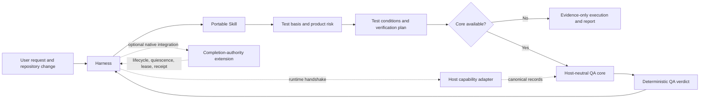
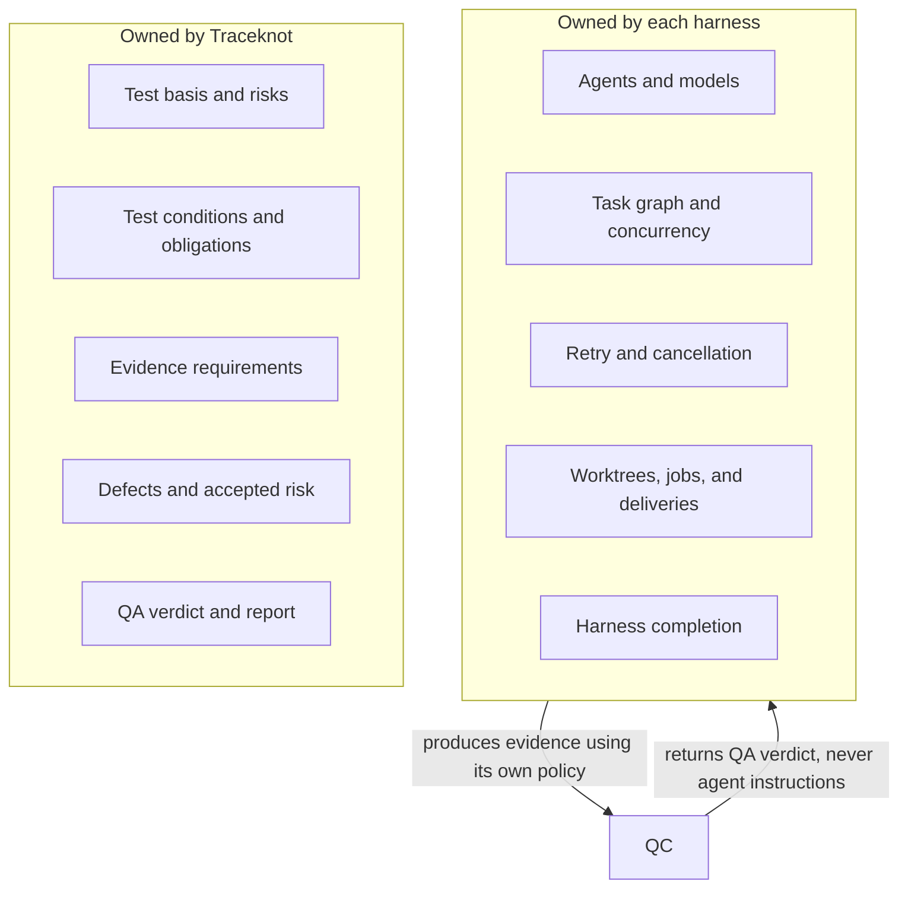

# Traceknot

<p align="center"></p>

**Evidence-bound QA for coding agents.**

[Website](https://traceknot.kyungho.info) · [한국어 문서](README.ko.md) · [Brand system](BRAND.md)

Traceknot is an ISTQB-aligned, evidence-bound QA framework for coding-agent harnesses such as OMP, Codex, Claude Code, OpenCode, and GajaeCode. It separates portable test-process guidance from deterministic QA decisions and optional harness-level completion authority.

The framework does **not** manage subagents. Each harness owns its agents, models, task graph, concurrency, retries, worktrees, lifecycle, and final task completion. Traceknot defines what must be verified, what evidence is acceptable, how defects and residual risk are handled, and how the QA verdict is resolved.

> `QA PASS` means the declared test basis and mandatory verification obligations passed. It does not mean every harness task, agent, job, or delivery has completed.

## Why Traceknot

Coding-agent harnesses already orchestrate agents, tools, jobs, retries, and lifecycle events. Those signals establish that activity occurred; they do not establish that the declared change was sufficiently verified.

| Native signal | Missing QA guarantee |
|---|---|
| Turn, task, or subagent ended | Mandatory verification passed |
| Command exited successfully | Test basis and risk coverage are sufficient |
| Agent reported completion | Evidence is independent, current, and snapshot-bound |
| Observed jobs became idle | Global quiescence or absence of unobserved work |
| Hook or app-server event fired | Deterministic QA verdict or completion authority |

Traceknot supplies the missing test-process layer: traceability from basis through verdict, explicit evidence and independence requirements, defect and residual-risk handling, and deterministic verdict precedence. Every verdict is knotted to its evidence; lifecycle events remain observations, never proof by themselves.

## Status

| Surface | Status |
|---|---|
| Portable ISTQB-aligned Skill | Implemented |
| Canonical QA record schemas | Implemented and schema-validated |
| Host-neutral deterministic verdict core | Implemented and tested |
| Harness capability manifests | Implemented; runtime capabilities default to none |
| Completion-authority contracts and models | Preserved as an optional extension |
| Native OMP/Codex/Claude/OpenCode integration | Not implemented |
| Phase B completion enforcement | Not authorized; `phase1Authorized: false` |
| Installer, package registry release, and public CLI | Not implemented |

The portable Skill and host-neutral core are usable now. Authoritative harness completion remains an explicitly separate integration project.

## Architecture



### Responsibility boundary



Traceknot specifies evidence requirements and minimum independence. It never instructs a harness to create a particular subagent, use a particular model, or apply a particular concurrency policy.

## QA process

```mermaid
flowchart LR
    A[Test basis] --> B[Product risk]
    B --> C[Test conditions]
    C --> D[Test techniques]
    D --> E[Mandatory obligations]
    E --> F[Entry criteria]
    F --> G[Execution and evidence]
    G --> H[Defects and regression]
    H --> I[Exit criteria]
    I --> J[Residual risk]
    J --> K[QA verdict]
```



The Skill applies seven foundational testing principles:

1. Testing shows the presence of defects, not their absence.
2. Exhaustive testing is impossible.
3. Early testing reduces cost and delay.
4. Defects cluster in specific surfaces.
5. Repeated tests lose defect-finding power.
6. Testing is context dependent.
7. A green technical suite is insufficient when user or business needs are unmet.

Traceability is bidirectional:

```text
test basis ↔ risk ↔ test condition ↔ obligation ↔ evidence ↔ defect
```

## Verdict model

| Verdict | Meaning |
|---|---|
| `PASS` | Every mandatory obligation and required coverage passed; no unaccepted material risk remains. |
| `PASS_WITH_ACCEPTED_RISK` | Mandatory obligations passed and every remaining material risk has valid, unexpired acceptance. |
| `FAIL` | A mandatory obligation failed or an unaccepted material defect remains. |
| `BLOCKED` | A mandatory prerequisite or required capability was unavailable. |
| `INCOMPLETE` | Mandatory evidence or required coverage has no terminal result. |

Precedence is deterministic:

```text
FAIL → BLOCKED → INCOMPLETE → PASS_WITH_ACCEPTED_RISK → PASS
```

The host-neutral core always emits `authoritative: false`. Only a separately integrated completion-authority extension could make a harness-level authority claim.

## Repository layout

```text
.
├── README.md
├── README.ko.md
├── skill/
│   ├── SKILL.md
│   └── references/
├── contracts/
│   ├── capability.schema.json
│   ├── verification-request.schema.json
│   ├── verification-plan.schema.json
│   ├── evidence.schema.json
│   ├── defect.schema.json
│   └── verdict.schema.json
├── adapters/
│   ├── omp/
│   ├── codex/
│   ├── claude-code/
│   ├── opencode/
│   └── gajae-code/
└── system/
    ├── core/
    │   ├── qa-core.ts
    │   └── qa-core.test.ts
    └── extensions/
        └── harness-completion-authority/
            └── quality-contract/
```

### `skill/`

The portable, host-neutral workflow. It covers test basis, risk analysis, test design, entry and exit criteria, evidence, defect lifecycle, traceability, residual risk, and completion reporting.

Start with [skill/SKILL.md](skill/SKILL.md). Detailed guidance is in [skill/references](skill/references/).

### `contracts/`

Closed JSON Schema Draft 2020-12 records shared by a Skill, harness adapter, core validator, or external implementation:

- host capability;
- verification request;
- verification plan;
- evidence;
- defect;
- QA verdict.

Host names grant no capability. A runtime handshake must advertise and prove each capability.

### `adapters/`

Conservative capability manifests for supported harness names. All default capabilities are `false`; this prevents accidental trust escalation. A real adapter must provide current runtime capabilities and evidence without taking over the harness's agent policy.

### `system/core/`

A host-neutral TypeScript verdict resolver. It rejects duplicate obligation results, cross-snapshot evidence, insufficient producer independence, missing evidence identifiers, incomplete traceability coverage, open material defects, and expired risk acceptance.

### Completion-authority extension

[system/extensions/harness-completion-authority](system/extensions/harness-completion-authority/) preserves the existing lifecycle, quiescence, lease, receipt, terminal-pair, SQLite, schema, and generated-evidence contracts.

This extension is optional and disabled by policy. Lifecycle events such as task completion, subagent stop, turn completion, or agent end remain observations and cannot independently seal or verify completion.

## Using the portable Skill

Install or expose the contents of `skill/` using the Skill mechanism provided by your harness. The Skill itself has no runtime dependency on `system/`.

The expected workflow is:

1. identify the target snapshot and change scope;
2. collect explicit and derived test-basis items;
3. classify product risk;
4. derive observable test conditions and expected results;
5. select test techniques and mandatory obligations;
6. verify entry criteria;
7. let the harness execute checks under its own orchestration policy;
8. capture evidence and defects;
9. evaluate coverage, exit criteria, and residual risk;
10. issue a QA verdict separately from harness completion.

## Developing the core

Requirements:

- Bun
- TypeScript available through `bun x tsc`

Run the host-neutral core tests:

```bash
bun test system/core/qa-core.test.ts
```

Run strict type checking:

```bash
bun x tsc --ignoreConfig --noEmit --strict \
  --target ES2022 --module ESNext --moduleResolution Bundler \
  system/core/qa-core.ts
```

Validate the canonical schemas:

```bash
bunx ajv-cli@5 compile --spec=draft2020 \
  -s 'contracts/*.schema.json'
```

Validate the bundled capability records:

```bash
bunx ajv-cli@5 validate --spec=draft2020 \
  -s contracts/capability.schema.json \
  -d 'adapters/*/capability.json'
```

## Verifying the completion-authority extension

Run from the extension root:

```bash
cd system/extensions/harness-completion-authority
bun quality-contract/scripts/verify-models.ts
bun quality-contract/scripts/verify-sqlite.ts
bun quality-contract/scripts/run-phase-b-verification.ts --intent
```

Strictly type-check the preserved models:

```bash
bun x tsc --ignoreConfig --noEmit --strict \
  --target ES2022 --module ESNext --moduleResolution Bundler \
  quality-contract/models/lifecycle-model.ts \
  quality-contract/models/storage-model.ts \
  quality-contract/models/quiescence-budget-model.ts
```

Current preserved verification evidence:

- model verifier: 570 passed, 0 failed;
- explored model states: 6,304;
- explored transitions: 27,152;
- SQLite verifier: 138 passed, 0 failed;
- Phase B intent: valid and `phase1Authorized: false`.

## Security and trust model

- Missing, cancelled, timed-out, or incomplete mandatory evidence is never PASS.
- Evidence must bind to the target snapshot and obligation.
- Required producer independence cannot be silently downgraded.
- Material risk acceptance requires an owner, reason, mitigation, and expiry.
- A host lifecycle notification is not QA evidence by itself.
- The core does not claim global quiescence or harness completion.
- The completion-authority extension must not be activated without an explicit native integration and approval process.

## Readiness assessment

**Ready with follow-ups** for portable Skill evaluation and host-neutral QA-core development.

Not yet ready for:

- package-manager or Skill-registry distribution;
- one-command installation;
- native OMP, Codex, Claude Code, OpenCode, or GajaeCode adapters;
- authoritative harness completion;
- production signing or receipt authority.

The next delivery milestone should add distribution metadata and one runtime adapter without weakening the evidence-only default.

## License

Traceknot is free software licensed under the [GNU General Public License v3.0](LICENSE).
