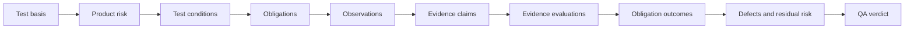

# Traceknot

<!-- readme-section:hero -->

<p align="center">
  
</p>

<p align="center"><strong>Auditable QA for coding agents.</strong></p>

<p align="center">
  Turn test basis, product risk, and runtime evidence into traceable, deterministic QA verdicts.
</p>

<p align="center">
  <a href="README.md">English</a> ·
  <a href="README.ko.md">한국어</a> ·
  <a href="README.zh.md">简体中文</a>
</p>

<p align="center">
  <a href="https://github.com/Jin-Doh/traceknot/actions/workflows/ci.yml"></a>
  <a href="https://github.com/Jin-Doh/traceknot/releases"></a>
  <a href="LICENSE"></a>
</p>

<p align="center">
  <a href="https://traceknot.kyungho.info">Website</a> ·
  <a href="BRAND.md">Brand system</a>
</p>

Traceknot is an ISTQB-aligned QA framework for coding-agent harnesses such as OMP, Codex, Claude Code, OpenCode, and GajaeCode. Its portable Skill defines the test process; its optional host-neutral core validates canonical records and resolves verdicts.

Traceknot does not orchestrate agents. The host still owns models, task graphs, concurrency, retries, worktrees, lifecycle, and final delivery. Traceknot owns the QA question: what must be verified, which evidence is acceptable, what remains at risk, and which verdict follows.

Proof-carrying success keeps four layers distinct: an Observation records facts, an Evidence Claim interprets those facts for an obligation, an Evidence Evaluation accepts or rejects the claim, and an Obligation Outcome records the result. Only accepted positive evidence bound to the target snapshot may satisfy a mandatory criterion.

> `QA PASS` means the declared test basis and mandatory verification obligations passed. It does not mean every agent, task, job, or delivery completed.

<!-- readme-section:quick-start -->

## Quick start

Install the portable Skill with Node.js 22.20 or later:

<!-- shared-command:skill-install -->

```sh
npx skills add Jin-Doh/traceknot --skill traceknot --global
```

Then ask your coding agent to apply it to a concrete change:

```text
Apply Traceknot to verify this change. Report the test basis, risks,
mandatory obligations, observed evidence, defects, residual risk,
and final QA verdict separately from task completion.
```

The Skill is self-contained. It can run the complete evidence-only workflow without the optional TypeScript core.

<!-- readme-section:why -->

## Why Traceknot

Coding-agent harnesses already report activity. Activity is useful, but it is not a QA verdict.

| Native signal | What it does not establish |
|---|---|
| A task or agent stopped | Mandatory verification passed |
| A command exited successfully | Test basis and risk coverage are sufficient |
| An agent reported completion | Evidence is current, independent, and snapshot-bound |
| Observed jobs became idle | No unobserved work remains |
| A lifecycle hook fired | A deterministic QA verdict or completion authority |

Traceknot adds the missing test-process layer. It links the declared basis, risks, conditions, obligations, evidence, defects, and residual risk to a repeatable verdict.

<!-- readme-section:outputs -->

## What you get

- A test basis derived from requirements, contracts, repository policy, and acceptance criteria.
- Product-risk classification with a universal trigger scan and bounded challenge when risk warrants it.
- Observable test conditions and mandatory verification obligations.
- Evidence bound to the target snapshot, producer, and obligation.
- Proof-carrying observations, claims, evaluations, and outcomes that remain independently inspectable.
- Defect and residual-risk handling that never converts missing evidence into a pass.
- A deterministic verdict with explicit precedence.

An illustrative completion report looks like this:

```text
Verdict             PASS_WITH_ACCEPTED_RISK
Snapshot            8f3c2a1
Mandatory checks    7 / 7 passed
Evidence            snapshot-bound
Residual risk       1 accepted, with owner and expiry
Harness authority   false
```

This is an example for orientation, not a substitute for the canonical JSON records or an observed run.

<!-- readme-section:process -->

## How it works



Every run performs a cheap trigger scan before final risk classification. A bounded adversarial challenge runs only when the change is materially risky, scope remains unknown, evidence bypasses the changed contract, or a recurring defect cluster is involved.

The final verdict follows this precedence:

```text
FAIL → BLOCKED → INCOMPLETE → PASS_WITH_ACCEPTED_RISK → PASS
```

Use Traceknot for implementation verification, bug-fix confirmation, release checks, repository audits, evidence reviews, and residual-risk decisions. Read the [full QA process](docs/qa-process.md) for the test techniques, discovery rules, traceability model, and completion-report contract.

<!-- readme-section:status -->

## Available today

| Surface | Status and boundary |
|---|---|
| Portable ISTQB-aligned Skill | **Available.** Evidence-only workflow; no core dependency |
| Canonical QA record schemas | **Available.** Closed JSON Schema Draft 2020-12 contracts |
| Proof-carrying evidence records | **Available.** Observation, claim, evaluation, success-criterion, traceability, and verification-run contracts |
| Host-neutral verdict core | **Available.** Emits `authoritative: false` |
| Capability manifests | **Available.** Static manifests are conservative and grant no runtime capability |
| User-local full-toolkit installer and updater | **Available.** GitHub release artifacts, digest, and provenance verification |
| End-to-end `traceknot verify` CLI | **Available.** Validated explicit-command manifests, snapshot-bound evidence, durable resume/report, JSON or Markdown output |
| Native OMP, Codex, Claude Code, OpenCode, or GajaeCode adapters | **Not implemented.** A host name alone grants no capability |
| Harness completion authority | **Disabled by default.** Optional extension; `phase1Authorized: false` |
| npm package or dedicated Skill-registry listing | **Not available.** Direct GitHub installation through the Skills CLI is available |

The portable Skill and host-neutral core are usable now. Authoritative harness completion remains a separate integration project.

## Verify CLI

`traceknot verify` executes a validated explicit-command manifest through the local collector and persists each VerificationRun checkpoint atomically. Run state and content-addressed artifacts default to an external user cache, so their writes do not change the Git snapshot under verification:

```sh
traceknot verify --request request.json --manifest manifest.json --root .
```

The request must identify the current Git `rootIdentity` and `snapshotId`; either field may use the literal `auto`. A `verification-manifest/v1` manifest assigns one absolute executable plus an argument array to each generated obligation. Shell-string interpolation is rejected.

JSON is the default machine-readable report. Use `--format markdown` for a human-readable report, or `--report-only --run-id ID` to read a terminal run without re-executing commands. Exit codes are `0` for `PASS` or `PASS_WITH_ACCEPTED_RISK`, `1` for `FAIL`, `2` for `BLOCKED`, `3` for `INCOMPLETE`, `64` for invalid input, and `70` for internal failure.

<!-- readme-section:install -->

## Installation choices

### Portable Skill — recommended

The Quick Start command installs `skill/SKILL.md` and its references through the Skills CLI. Add `--agent codex` to target Codex only, or omit `--global` to install into the current project.

Manage the installation with the same CLI:

```sh
npx skills list --global
npx skills update traceknot --global --yes
npx skills remove traceknot --global --yes
```

### Full toolkit — advanced

Install the Skill together with the schemas, capability manifests, host-neutral core, and verified release updater:

<!-- shared-command:full-toolkit-install -->

```sh
curl -fsSL https://raw.githubusercontent.com/Jin-Doh/traceknot/main/install.sh | sh
```

Inspect the script or use a fixed tag before running it in a controlled environment. The installer works without `sudo`, supports `--dry-run`, and defaults to `${XDG_DATA_HOME:-$HOME/.local/share}/traceknot`.

Pin both the bootstrap script and downloaded payload to the same tag or commit:

<!-- shared-command:full-toolkit-pinned-install -->

```sh
TRACEKNOT_REF=<tag-or-commit>
curl -fsSL "https://raw.githubusercontent.com/Jin-Doh/traceknot/$TRACEKNOT_REF/install.sh" \
  | TRACEKNOT_REF="$TRACEKNOT_REF" sh
```

The Skills CLI and full-toolkit installer manage the same user-local Skill registration. Remove one installation before switching methods. See [automatic updates](docs/automatic-updates.md) for eligibility, verification, rollback, and opt-out behavior.

Remove the default full-toolkit installation with:

<!-- shared-command:full-toolkit-uninstall -->

```sh
curl -fsSL https://raw.githubusercontent.com/Jin-Doh/traceknot/main/uninstall.sh | sh
```

For a custom installation prefix, append `-s -- --prefix /absolute/path` after `sh`.

If the installation also used a custom Skills root, pass the same value to the uninstaller:

<!-- shared-command:full-toolkit-custom-uninstall -->

```sh
curl -fsSL https://raw.githubusercontent.com/Jin-Doh/traceknot/main/uninstall.sh \
  | TRACEKNOT_SKILLS_ROOT=/absolute/skills sh -s -- --prefix /absolute/path
```

Runnable updater commands, including active-layout and legacy-layout path selection, are documented in [automatic updates](docs/automatic-updates.md).

<!-- readme-section:documentation -->

## Documentation

| Topic | Document |
|---|---|
| Test process, risk discovery, verdicts, and traceability | [QA process](docs/qa-process.md) |
| Normative Observation → Claim → Evaluation → Outcome semantics | [Proof-carrying success](skill/references/proof-carrying-success.md) |
| Components, responsibilities, adapters, and repository layout | [Architecture](docs/architecture.md) |
| Evidence, capability, authority, and security boundaries | [Trust model](docs/trust-model.md) |
| Translation ownership and synchronization | [Localization](docs/localization.md) |
| Full-toolkit updater policy and recovery | [Automatic updates](docs/automatic-updates.md) |
| Security analysis and residual risks | [Security analysis](docs/security-analysis.md) |
| Portable executable workflow | [Skill specification](skill/SKILL.md) |
| Naming, voice, palette, and artwork | [Brand system](BRAND.md) |

<!-- readme-section:development -->

## Development

Core development requires Bun 1.3.14. Install the reviewed dependency graph without lifecycle scripts, then run the same canonical gate used in GitHub Actions:

<!-- shared-command:ci -->

```sh
bun install --frozen-lockfile --ignore-scripts
bun run ci
```

The gate validates installer lifecycle, schemas, capability records, prompt-injection risk, published prose, tests, strict TypeScript, and whitespace integrity. Run `bun run prose-quality` for the advisory Korean, English, and explicitly mapped Simplified Chinese publication-prose report.

Security-sensitive findings should include a concrete expected result, observed result, reproduction, affected snapshot, and residual risk. Do not report an agent's own completion claim as verification evidence.

## License

Traceknot is licensed under the [MIT License](LICENSE).
