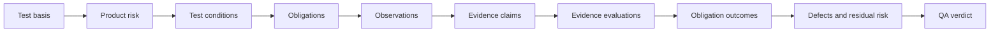

# Traceknot

<!-- readme-section:hero -->

<p align="center">
  
</p>

<p align="center"><strong>Auditable QA for coding agents.</strong></p>

<p align="center">
  Turn test basis, product risk, and runtime evidence into traceable, deterministic QA verdicts.
</p>

<p align="center">
  <a href="README.md">English</a> ·
  <a href="README.ko.md">한국어</a> ·
  <a href="README.zh.md">简体中文</a>
</p>

<p align="center">
  <a href="https://github.com/Jin-Doh/traceknot/actions/workflows/ci.yml"></a>
  <a href="https://github.com/Jin-Doh/traceknot/releases"></a>
  <a href="https://www.skills.sh/jin-doh/traceknot/traceknot"></a>
  <a href="LICENSE"></a>
</p>

<p align="center">
  <a href="https://traceknot.kyungho.info">Website</a> ·
  <a href="BRAND.md">Brand system</a> ·
  <a href="https://github.com/Jin-Doh/traceknot">Star on GitHub</a>
</p>

Traceknot is an ISTQB-aligned QA framework for coding-agent harnesses such as OMP, Codex, Claude Code, OpenCode, and GajaeCode. Its canonical Skill bundle contains the test process, the generated `traceknot` CLI, and the shared Board renderer; the host-neutral core validates canonical records and resolves verdicts.

Traceknot does not orchestrate agents. The host still owns models, task graphs, concurrency, retries, worktrees, lifecycle, and final delivery. Traceknot owns the QA question: what must be verified, which evidence is acceptable, what remains at risk, and which verdict follows.

Proof-carrying success keeps four layers distinct: an Observation records facts, an Evidence Claim interprets those facts for an obligation, an Evidence Evaluation accepts or rejects the claim, and an Obligation Outcome records the result. Only accepted positive evidence bound to the target snapshot may satisfy a mandatory criterion.

> `QA PASS` means the declared test basis and mandatory verification obligations passed. It does not mean every agent, task, job, or delivery completed.

<!-- readme-section:quick-start -->

## Quick start

Install the canonical Skill bundle with Node.js 22.20 or later and Bun 1.3.14 or later. Bun is required to run the bundled executable.

<!-- shared-command:skill-install -->

```sh
npx skills add Jin-Doh/traceknot --skill traceknot --global
```

Then ask your coding agent to apply it to a concrete change:

```text
Apply Traceknot to verify this change. Report the test basis, risks,
mandatory obligations, observed evidence, defects, residual risk,
and final QA verdict separately from task completion.
```

The Skill bundle is self-contained for the documented workflow. It includes `skill/bin/traceknot`, generated from the repository's `bin/traceknot`, and its references; no separate runtime installation is required beyond Bun.

<!-- readme-section:why -->

## Why Traceknot

Coding-agent harnesses already report activity. Activity is useful, but it is not a QA verdict.

| Native signal | What it does not establish |
|---|---|
| A task or agent stopped | Mandatory verification passed |
| A command exited successfully | Test basis and risk coverage are sufficient |
| An agent reported completion | Evidence is current, independent, and snapshot-bound |
| Observed jobs became idle | No unobserved work remains |
| A lifecycle hook fired | A deterministic QA verdict or completion authority |

Traceknot adds the missing test-process layer. It links the declared basis, risks, conditions, obligations, evidence, defects, and residual risk to a repeatable verdict.

<!-- readme-section:outputs -->

## What you get

- A test basis derived from requirements, contracts, repository policy, and acceptance criteria.
- Product-risk classification with a universal trigger scan and bounded challenge when risk warrants it.
- Observable test conditions and mandatory verification obligations.
- Evidence bound to the target snapshot, producer, and obligation.
- Proof-carrying observations, claims, evaluations, and outcomes that remain independently inspectable.
- Defect and residual-risk handling that never converts missing evidence into a pass.
- A deterministic verdict with explicit precedence.

An illustrative completion report looks like this:

```text
Verdict             PASS_WITH_ACCEPTED_RISK
Snapshot            8f3c2a1
Mandatory checks    7 / 7 passed
Evidence            snapshot-bound
Residual risk       1 accepted, with owner and expiry
Harness authority   false
```

This is an example for orientation, not a substitute for the canonical JSON records or an observed run.

<!-- readme-section:process -->

## How it works



Every run performs a cheap trigger scan before final risk classification. A bounded adversarial challenge runs only when the change is materially risky, scope remains unknown, evidence bypasses the changed contract, or a recurring defect cluster is involved.

The final verdict follows this precedence:

```text
FAIL → BLOCKED → INCOMPLETE → PASS_WITH_ACCEPTED_RISK → PASS
```

Use Traceknot for implementation verification, bug-fix confirmation, release checks, repository audits, evidence reviews, and residual-risk decisions. Read the [full QA process](docs/qa-process.md) for the test techniques, discovery rules, traceability model, and completion-report contract.

<!-- readme-section:status -->

## Available today

| Surface | Status and boundary |
|---|---|
| Canonical ISTQB-aligned Skill bundle | **Available.** Includes the evidence-only workflow, generated `skill/bin/traceknot` CLI, and Board renderer |
| Canonical QA record schemas | **Available.** Closed JSON Schema Draft 2020-12 contracts |
| Proof-carrying evidence records | **Available.** Observation, claim, evaluation, success-criterion, traceability, and verification-run contracts |
| Host-neutral verdict core | **Available.** Emits `authoritative: false` |
| Shared capability model and manifests | **Available.** One closed nine-field model governs v2 manifests and runtime discovery; static host names grant no capability |
| Canonical session QA Board | **Available.** `$HOME/.agents/skills/traceknot/bin/traceknot board update` publishes immutable session revisions, stable `index.html`/`manifest.json`/`current.json`, and retention-protected current pointers |
| Skills CLI installation and update | **Available.** `npx skills add Jin-Doh/traceknot --skill traceknot` and `npx skills update traceknot` copy the same complete Skill payload |
| Optional legacy launcher/bootstrap | **Available.** Curl entrypoint for environments that need it; it is not a separate feature tier |
| Reusable governed GitHub Action | **Available.** Separate lifecycle and verdict checks, fail-closed required aggregation, retained canonical artifacts, job summary, and optional SARIF upload |
| Deterministic 1.0 release benchmark | **Available.** Zero-tolerance proof-verdict, cache-boundary, integrity, and honest unavailable-usage gates; not provider-efficiency evidence |
| Native OMP, Codex, Claude Code, OpenCode, or GajaeCode adapters | **Not implemented.** Codex and Claude Code capability-envelope validation primitives are available, but they do not provide native transport or invocation. A host name alone grants no capability |
| Harness completion authority | **Disabled by default.** Optional extension; `phase1Authorized: false` |
| npm package or dedicated Skill-registry listing | **Not available.** Direct GitHub installation through the Skills CLI is available |

The canonical Skill bundle and host-neutral core are usable now. Authoritative harness completion remains a separate integration project.

## Verify CLI

`$HOME/.agents/skills/traceknot/bin/traceknot verify` executes a validated explicit-command manifest through the local collector and persists each VerificationRun checkpoint atomically. Run state and content-addressed artifacts default to an external user cache, so their writes do not change the Git snapshot under verification:

```sh
$HOME/.agents/skills/traceknot/bin/traceknot verify --request request.json --manifest manifest.json --root .
```

The request must identify the current Git `rootIdentity` and `snapshotId`; either field may use the literal `auto`. A `verification-manifest/v1` manifest assigns each generated obligation either an absolute executable with an argument array, an absolute `executionCompletionPath`, or both. Shell-string interpolation is rejected.

The CLI's local collector is a harness-managed, separate-verification-context producer. It does not claim `independent-producer` provenance for its own command results or caller-supplied oracle files. An R3, visual-composition, UI-resilience, or other obligation whose profile requires independent evidence therefore cannot pass from those inputs alone.

For a visual-composition obligation, set its absolute `visualCompositionOraclePath` and declare every screenshot, design-token-resolution, or approved-visual-reference artifact with its original `type`, `digest`, and `path`. The CLI validates the oracle, securely ingests the declared artifacts, and preserves their evidence types. Screenshot evidence must be a decodable PNG. Whole-page dimensions must match the capture viewport and device-pixel ratio; focused-region dimensions must cover their bound measured region.

For a UI content-resilience obligation, set its absolute `uiResilienceOraclePath`. Declare screenshots, `ui-applicability-approval`, `ui-full-text-access`, and `ui-visual-review-approval-receipt` artifacts with their original type, digest, and path. The request's surface capability inventory determines required profiles; every non-applicable profile needs a stored approval artifact, and paint-level human review needs an independently authenticated receipt before it can contribute to `PASS`.

An independent producer may instead return a `verification-execution-completion/v1` envelope through an obligation's absolute `executionCompletionPath`. The envelope must bind the exact request, plan, obligation, snapshot, idempotency key, output, artifacts, and oracle digests. List each signed artifact once in `executionCompletionArtifacts` with its type, digest, and absolute handoff path outside the Git root; Traceknot authenticates the signed artifact set before securely reading, hashing, and publishing those bytes into its own fresh artifact store. The envelope is accepted only when its Ed25519 signature verifies against the root-owned `/etc/traceknot/trusted-producer.json` policy (`trusted-producer-policy/v1`), which must be a regular file with no group or world write permission. Invalid, substituted, unsigned, untrusted, missing-byte, or digest-mismatched inputs fail closed and cannot fall back to caller-authored independent provenance.

JSON is the default machine-readable report. Use `--format markdown` for a human-readable report, or `--report-only --run-id ID` to read a terminal run without re-executing commands. Exit codes are `0` for `PASS` or `PASS_WITH_ACCEPTED_RISK`, `1` for `FAIL`, `2` for `BLOCKED`, `3` for `INCOMPLETE`, `64` for invalid input, and `70` for internal failure.

<!-- readme-section:install -->

## Installation choices

### Skills CLI — canonical installation

The Quick Start command installs the complete `skill/` tree, including `SKILL.md`, references, and executable `skill/bin/traceknot`. The generated CLI requires Bun 1.3.14 or later. Add `--agent codex` to target Codex only, or omit `--global` to install into the current project.

```sh
npx skills add Jin-Doh/traceknot --skill traceknot --global
```

Manage the same complete payload with the Skills CLI:

```sh
npx skills list --global
npx skills update traceknot --global --yes
npx skills remove traceknot --global --yes
```

For a project-local installation, run `npx skills update traceknot --yes` and `npx skills remove traceknot --yes` from the project root; do not pass `--global`.

For a global Skills CLI install, invoke `$HOME/.agents/skills/traceknot/bin/traceknot`; for a project-local install, run `.agents/skills/traceknot/bin/traceknot` from the project root. Run `$HOME/.agents/skills/traceknot/bin/traceknot self-check` after a global installation or update; for a project-local installation, substitute `.agents/skills/traceknot/bin/traceknot self-check`. Session Board publication uses `$HOME/.agents/skills/traceknot/bin/traceknot board update --input UPDATE.json --state-dir DIR [--artifact-dir DIR] [--open-board] [--no-notify]` globally and `.agents/skills/traceknot/bin/traceknot board update --input UPDATE.json --state-dir DIR [--artifact-dir DIR] [--open-board] [--no-notify]` for a project-local installation. Do not fall back to an unrelated global executable. After read-back validation the publisher prints `Traceknot Board: file://.../sessions/<session-key>/index.html`. See [QA Board](docs/qa-board.md) for the `traceknot-session-board-update/v1` envelope, unavailable behavior, and `boardMaxPerSession` retention.

### Legacy curl launcher/bootstrap — optional

The legacy curl entrypoint remains an optional prefix launcher/updater for environments that need it. It does not create, replace, retarget, update, or remove a Skills CLI-owned registration and does not define a separate Skill payload, runtime tier, Board renderer, schema, or verdict mode. Reinstall or update removes only a legacy symlink that points into the same prefix. The Skills CLI path above remains canonical. Inspect the script or use a fixed tag before running it in a controlled environment.

<!-- shared-command:full-toolkit-install -->

```sh
curl -fsSL https://raw.githubusercontent.com/Jin-Doh/traceknot/main/install.sh | sh
```

Pin the bootstrap script and downloaded payload to the same tag or commit:

<!-- shared-command:full-toolkit-pinned-install -->

```sh
TRACEKNOT_REF=<tag-or-commit>
curl -fsSL "https://raw.githubusercontent.com/Jin-Doh/traceknot/$TRACEKNOT_REF/install.sh" \
  | TRACEKNOT_REF="$TRACEKNOT_REF" sh
```

The launcher manages only its prefix release files through `traceknot-update`; use [automatic updates](docs/automatic-updates.md) for status, check, apply, rollback, enable, and disable operations. `npx skills update traceknot --global --yes` independently updates the canonical Skills CLI registration. The two can coexist because the launcher never writes that registration. Use the pinned uninstaller below to remove only launcher-managed files.

Remove launcher-managed files with:

<!-- shared-command:full-toolkit-uninstall -->

```sh
curl -fsSL https://raw.githubusercontent.com/Jin-Doh/traceknot/main/uninstall.sh | sh
```

For a custom installation prefix, append `-s -- --prefix /absolute/path` after `sh`. `TRACEKNOT_SKILLS_ROOT` is needed only when migrating or removing a legacy Traceknot-owned registration symlink from a non-default location:

<!-- shared-command:full-toolkit-custom-uninstall -->

```sh
curl -fsSL https://raw.githubusercontent.com/Jin-Doh/traceknot/main/uninstall.sh \
  | TRACEKNOT_SKILLS_ROOT=/absolute/skills sh -s -- --prefix /absolute/path
```

The legacy launcher is optional; it never replaces `npx skills add`/`npx skills update` as the canonical installation lifecycle.

<!-- readme-section:documentation -->

## Documentation

| Topic | Document |
|---|---|
| Test process, risk discovery, verdicts, and traceability | [QA process](docs/qa-process.md) |
| Normative Observation → Claim → Evaluation → Outcome semantics | [Proof-carrying success](skill/references/proof-carrying-success.md) |
| Components, responsibilities, adapters, and repository layout | [Architecture](docs/architecture.md) |
| Evidence, capability, authority, and security boundaries | [Trust model](docs/trust-model.md) |
| Static QA Board, storage inspection, retention, and cleanup | [QA Board](docs/qa-board.md) |
| Translation ownership and synchronization | [Localization](docs/localization.md) |
| Optional launcher updater policy and recovery | [Automatic updates](docs/automatic-updates.md) |
| Deterministic 1.0 quality, cache, and token-accounting gates | [Release readiness](docs/release-readiness.md) |
| Security analysis and residual risks | [Security analysis](docs/security-analysis.md) |
| Executable Skill workflow | [Skill specification](skill/SKILL.md) |
| Naming, voice, palette, and artwork | [Brand system](BRAND.md) |

<!-- readme-section:development -->

## Development

Core development requires Bun 1.3.14. Install the reviewed dependency graph without lifecycle scripts, then run the same canonical gate used in GitHub Actions:

<!-- shared-command:ci -->

```sh
bun install --frozen-lockfile --ignore-scripts
bun run ci
```

The gate validates installer lifecycle, schemas, capability records, prompt-injection risk, published prose, the deterministic 1.0 release benchmark, tests, strict TypeScript, and whitespace integrity. It finishes with `bun run self-verify`, which runs the canonical gate through Traceknot against the captured repository snapshot without recursively invoking itself. The emitted report proves cold-miss to warm-hit content-cache parity and reports unavailable provider usage without fabricating zero token or cost values. Run `bun run benchmark:release` for the byte-stable quality/cache/token-accounting conformance report, and `bun run prose-quality` for the advisory Korean, English, and explicitly mapped Simplified Chinese publication-prose report.

The distributable CLI is generated deterministically from `bin/traceknot` with `bun run build:skill-runtime`; use `bun run check:skill-runtime` to reject generated-bundle drift. The generated executable is `skill/bin/traceknot` and requires Bun 1.3.14 or later.

Security-sensitive findings should include a concrete expected result, observed result, reproduction, affected snapshot, and residual risk. Do not report an agent's own completion claim as verification evidence.

## License

Traceknot is licensed under the [MIT License](LICENSE).
