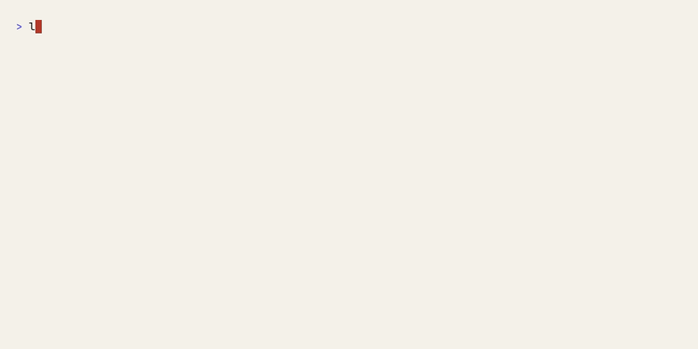
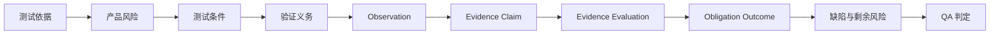

# Traceknot

<!-- readme-section:hero -->

<p align="center">
  
</p>

<p align="center"><strong>面向编码智能体的可审计 QA。</strong></p>

<p align="center">
  将测试依据、产品风险和运行时证据连接为可追溯、确定性的 QA 判定。
</p>

<p align="center">
  <a href="README.md">English</a> ·
  <a href="README.ko.md">한국어</a> ·
  <a href="README.zh.md">简体中文</a>
</p>

<p align="center">
  <a href="https://github.com/Jin-Doh/traceknot/actions/workflows/ci.yml"></a>
  <a href="https://github.com/Jin-Doh/traceknot/releases"></a>
  <a href="https://www.skills.sh/jin-doh/traceknot/traceknot"></a>
  <a href="LICENSE"></a>
</p>

<p align="center">
  <a href="https://traceknot.kyungho.info">网站</a> ·
  <a href="BRAND.md">品牌规范</a> ·
  <a href="https://github.com/Jin-Doh/traceknot">在 GitHub 上加星</a>
</p>

Traceknot 是一个面向 OMP、Codex、Claude Code、OpenCode 和 GajaeCode 等编码智能体运行框架的 ISTQB 对齐 QA 框架。规范 Skill bundle 包含测试流程、生成的 `traceknot` CLI 和共享 Board renderer；宿主中立核心验证规范记录并解析判定。

Traceknot 不编排智能体。模型、任务图、并发、重试、worktree、生命周期和最终交付仍由宿主负责。Traceknot 负责回答 QA 问题：必须验证什么、哪些证据可以接受、还剩下什么风险，以及这些事实应当产生什么判定。

Proof-carrying success 将四个层次明确分开：Observation 记录事实，Evidence Claim 解释这些事实如何支持某项义务，Evidence Evaluation 接受或拒绝该 claim，Obligation Outcome 记录结果。只有绑定到目标快照并已被接受的正向证据，才能满足强制标准。

> `QA PASS` 表示声明的测试依据和强制验证义务已经通过。它不表示所有智能体、任务、job 或交付都已完成。

<!-- readme-section:quick-start -->

## 快速开始

使用 Node.js 22.20 或更高版本以及 Bun 1.3.14 或更高版本安装规范 Skill bundle。运行生成的 CLI 必须使用 Bun。

<!-- shared-command:skill-install -->

```sh
npx skills add Jin-Doh/traceknot --skill traceknot --global
```

安装后，让编码智能体把 Traceknot 应用于一项具体变更：

```text
请使用 Traceknot 验证这项变更。分别报告测试依据、风险、
强制验证义务、已观察证据、缺陷、剩余风险和最终 QA 判定，
不要把 QA 判定与任务完成状态混为一谈。
```

观看内置的 Verify CLI 端到端执行包含两个义务的清单：证据收集、PASS 判定与会话 QA 看板发布，全部为真实运行。



该 Skill bundle 在 macOS 和提供 `libc.so.6` 的 glibc-based Linux 上自包含地提供文档化 workflow 所需内容，包括由仓库 `bin/traceknot` 生成的 `skill/bin/traceknot` 和参考资料；除 Bun 与平台 C library 外不需要单独安装 Traceknot runtime。Local artifact store 与 command collector 不支持原生 Windows 或 musl-only Linux；native library 不可用时，`traceknot self-check` 会 fail-closed。

<!-- readme-section:why -->

## 为什么需要 Traceknot

编码智能体运行框架已经能够报告活动状态，但“发生了活动”并不等同于 QA 判定。

| 原生信号 | 仅凭该信号无法证明的内容 |
|---|---|
| 任务或智能体停止 | 强制验证是否通过 |
| 命令成功退出 | 测试依据和风险覆盖是否充分 |
| 智能体报告完成 | 证据是否最新、独立并绑定到目标快照 |
| 已观察 job 进入 idle 状态 | 是否仍有未观察到的工作 |
| 生命周期 hook 触发 | 是否形成确定性 QA 判定或完成权限 |

Traceknot 补上缺失的测试流程层。它把声明的依据、风险、条件、义务、证据、缺陷和剩余风险连接起来，使相同输入得到相同判定。

<!-- readme-section:outputs -->

## 你会得到什么

- 从需求、契约、仓库策略和验收标准中整理出的测试依据
- 每次运行都会执行的 trigger scan，以及只在风险需要时执行的 bounded challenge
- 可观察的测试条件和强制验证义务
- 绑定到目标快照、证据生产者和验证义务的证据
- 可以分别检查的 proof-carrying observation、claim、evaluation 和 outcome
- 不会把缺失证据转换为 PASS 的缺陷与剩余风险处理
- 按明确优先级计算的确定性判定

完成报告大致会呈现以下信息：

```text
Verdict             PASS_WITH_ACCEPTED_RISK
Snapshot            8f3c2a1
Mandatory checks    7 / 7 passed
Evidence            snapshot-bound
Residual risk       1 accepted, with owner and expiry
Harness authority   false
```

以上内容仅用于说明，不替代规范 JSON record，也不代表一次真实运行的观察结果。

<!-- readme-section:process -->

## 工作方式



每次运行都会在最终风险分级之前执行一次轻量 trigger scan。只有当变更存在实质风险、范围仍不明确、当前证据绕过了已变更契约，或变更涉及重复缺陷集群时，才会执行 bounded adversarial challenge。

最终判定遵循以下优先级：

```text
FAIL → BLOCKED → INCOMPLETE → PASS_WITH_ACCEPTED_RISK → PASS
```

Traceknot 适用于实现验证、缺陷修复确认、发布检查、仓库审计、证据审查和剩余风险决策。完整的测试技术、discovery 规则、可追溯模型和完成报告契约请参阅 [QA 流程](docs/qa-process.md)。

<!-- readme-section:status -->

## 当前可用范围

| 能力 | 状态与边界 |
|---|---|
| 规范 ISTQB 对齐 Skill bundle | **可用。** 包含 evidence-only 工作流、生成的 `skill/bin/traceknot` CLI 和 Board renderer |
| 规范 QA record schema | **可用。** 封闭的 JSON Schema Draft 2020-12 契约 |
| Proof-carrying evidence record | **可用。** Observation、claim、evaluation、success criterion、traceability 和 verification run 契约 |
| 宿主中立 verdict core | **可用。** 始终输出 `authoritative: false` |
| 共享 capability model 和 manifest | **可用。** 一个封闭的九字段 model 同时约束 v2 manifest 与 runtime discovery；静态 host 名称不会授予 capability |
| 规范 session QA Board | **可用。** `$HOME/.agents/skills/traceknot/bin/traceknot board update` 发布不可变 session revision、稳定的 `index.html`/`manifest.json`/`current.json`，并应用保留策略 |
| Skills CLI 安装和更新 | **可用。** `npx skills add Jin-Doh/traceknot --skill traceknot` 与 `npx skills update traceknot` 复制同一个完整 Skill payload |
| 可选 legacy launcher/bootstrap | **可用。** 面向需要它的环境的 curl entrypoint，不是独立 feature tier |
| 可复用的 governed GitHub Action | **可用。** 分离 lifecycle 与 verdict check，fail-closed required 汇总，保留 canonical artifact，发布 job summary，并可选上传 SARIF |
| 确定性的 1.0 release benchmark | **可用。** 对 proof verdict、cache boundary、integrity 和 unavailable usage 诚实性执行零容错 hard gate；不作为 provider 效率证据 |
| OMP、Codex、Claude Code、OpenCode 或 GajaeCode 原生 adapter | **尚未实现。** 当前提供 Codex 与 Claude Code capability envelope 验证 primitive，但不提供原生 transport 或 invocation；仅凭宿主名称不会获得 capability |
| 运行框架完成权限 | **默认禁用。** 可选 extension，`phase1Authorized: false` |
| npm package 或专用 Skill registry 条目 | **暂不提供。** 可以通过 Skills CLI 直接从 GitHub 安装 |

规范 Skill bundle 和宿主中立核心现在即可使用。对运行框架完成状态作出权威声明仍属于单独的集成项目。
<!-- readme-capability:verify -->

## Verify CLI

Verify CLI 会通过本地 collector 执行经过校验的显式命令 manifest，并以原子方式持久化每个 VerificationRun checkpoint。请使用与安装范围一致的 executable；仅项目本地安装不得回退到无关的全局 executable。运行状态和 content-addressed artifact 默认写入外部用户缓存，不会修改正在验证的 Git snapshot：

```sh
# 全局安装
$HOME/.agents/skills/traceknot/bin/traceknot verify --request request.json --manifest manifest.json --root .
# 项目本地安装
.agents/skills/traceknot/bin/traceknot verify --request request.json --manifest manifest.json --root .
```

request 必须标识当前 Git `rootIdentity` 和 `snapshotId`；任一字段都可以使用字面值 `auto`。`verification-manifest/v1` 为每个 obligation 指定带参数的绝对 executable、绝对 `executionCompletionPath`，或同时指定二者；不接受 shell-string interpolation。

CLI 的 local collector 是由 harness 管理的 separate-verification-context producer，不会为自己的 command result 或调用者提供的 oracle 文件声明 `independent-producer` provenance。需要独立证据的 visual-composition、UI-resilience 或其他 obligation 不能仅凭这些输入通过。

visual-composition obligation 必须提供绝对路径的 `visualCompositionOraclePath`，并声明每个 screenshot、design-token-resolution 和 approved-visual-reference artifact 的原始 `type`、`digest` 与 `path`。UI content-resilience obligation 必须提供 `uiResilienceOraclePath` 及适用的 approval artifact；不适用的 profile 也必须保存 approval。缺少独立证据、完整文本访问或认证 review receipt 时，结果为 `INCOMPLETE`，不能伪造为 `PASS`。

独立 producer 可以通过绝对 `executionCompletionPath` 返回 `verification-execution-completion/v1` envelope。Traceknot 会绑定 request、plan、obligation、snapshot、idempotency key、output、artifact 和 oracle digest，并使用 root-owned、regular file 且没有 group 或 world write 权限的 `/etc/traceknot/trusted-producer.json` 中的 Ed25519 `trusted-producer-policy/v1` 验证签名；不可信或不完整的输入 fail-closed。

默认输出为 JSON。使用 `--format markdown` 获取可读报告，使用 `--report-only --run-id ID` 读取已完成运行而不重新执行命令。退出码：`0` 表示 PASS 或 PASS_WITH_ACCEPTED_RISK，`1` 表示 FAIL，`2` 表示 BLOCKED，`3` 表示 INCOMPLETE，`64` 表示输入无效，`70` 表示内部错误。

<!-- readme-section:install -->

## 安装方式

### Skills CLI — 规范安装路径

快速开始命令会通过 Skills CLI 安装完整的 `skill/` tree，包括 `SKILL.md`、参考资料和可执行文件 `skill/bin/traceknot`。生成的 CLI 需要 Bun 1.3.14 或更高版本。只为 Codex 安装时添加 `--agent codex`；只在当前项目中安装时省略 `--global`。

```sh
npx skills add Jin-Doh/traceknot --skill traceknot --global
```

使用以下 CLI 管理同一个完整 payload：

```sh
npx skills list --global
npx skills update traceknot --global --yes
npx skills remove traceknot --global --yes
```

项目本地安装应从项目根目录运行 `npx skills update traceknot --yes` 和 `npx skills remove traceknot --yes`，不要传入 `--global`。

全局 Skills CLI 安装应调用 `$HOME/.agents/skills/traceknot/bin/traceknot`；项目本地安装则从项目根目录调用 `.agents/skills/traceknot/bin/traceknot`。全局安装或更新后运行 `$HOME/.agents/skills/traceknot/bin/traceknot self-check`；项目本地安装必须改用 `.agents/skills/traceknot/bin/traceknot self-check`。Session Board 发布也应按安装范围选择：全局安装使用 `$HOME/.agents/skills/traceknot/bin/traceknot board update --input UPDATE.json --state-dir DIR [--artifact-dir DIR] [--open-board] [--no-notify]`，项目本地安装使用 `.agents/skills/traceknot/bin/traceknot board update --input UPDATE.json --state-dir DIR [--artifact-dir DIR] [--open-board] [--no-notify]`。不得回退到无关的全局可执行文件。Read-back 验证后输出 `Traceknot Board: file://.../sessions/<session-key>/index.html`。`traceknot-session-board-update/v1` envelope、prerequisite 缺失行为和 `boardMaxPerSession` 保留策略请参阅 [QA Board](docs/qa-board.md)。

```sh
$HOME/.agents/skills/traceknot/bin/traceknot self-check
.agents/skills/traceknot/bin/traceknot self-check
$HOME/.agents/skills/traceknot/bin/traceknot board update --input UPDATE.json --state-dir DIR
.agents/skills/traceknot/bin/traceknot board update --input UPDATE.json --state-dir DIR
```

### Legacy curl launcher/bootstrap — 可选

Legacy curl entrypoint 仅作为可选的 prefix launcher/updater 保留。它不会创建、替换、重新指向、更新或删除 Skills CLI 拥有的注册，也不定义独立的 Skill payload、runtime tier、Board renderer、schema 或 verdict mode。重新安装或更新只会删除指向同一 prefix 的 legacy symlink。上面的 Skills CLI 路径是规范路径。运行前请检查脚本或固定到具体 tag。

<!-- shared-command:full-toolkit-install -->

```sh
curl -fsSL https://raw.githubusercontent.com/Jin-Doh/traceknot/main/install.sh | sh
```

请将 bootstrap 脚本和下载的 payload 同时固定到同一个 tag 或 commit：

<!-- shared-command:full-toolkit-pinned-install -->

```sh
TRACEKNOT_REF=<tag-or-commit>
curl -fsSL "https://raw.githubusercontent.com/Jin-Doh/traceknot/$TRACEKNOT_REF/install.sh" \
  | TRACEKNOT_REF="$TRACEKNOT_REF" sh
```

Launcher 仅通过 `traceknot-update` 管理自身 prefix 中的 release 文件；状态、check、apply、rollback、enable、disable 操作请参阅[自动更新](docs/automatic-updates.md)。`npx skills update traceknot --global --yes` 独立更新规范的 Skills CLI 注册。由于 launcher 从不写入该注册，两种安装可以共存。下面固定的卸载命令只删除 launcher 管理的文件。

使用以下命令删除 launcher 管理的文件：

<!-- shared-command:full-toolkit-uninstall -->

```sh
curl -fsSL https://raw.githubusercontent.com/Jin-Doh/traceknot/main/uninstall.sh | sh
```

如果使用自定义安装路径，请在 `sh` 后附加 `-s -- --prefix /absolute/path`。只有在迁移或删除非默认位置中的 legacy Traceknot 所有注册 symlink 时，才需要设置 `TRACEKNOT_SKILLS_ROOT`：

<!-- shared-command:full-toolkit-custom-uninstall -->

```sh
curl -fsSL https://raw.githubusercontent.com/Jin-Doh/traceknot/main/uninstall.sh \
  | TRACEKNOT_SKILLS_ROOT=/absolute/skills sh -s -- --prefix /absolute/path
```

Legacy launcher 是可选项，不能替代 `npx skills add`/`npx skills update` 作为规范安装生命周期。

<!-- readme-section:documentation -->

## 文档

| 主题 | 文档 |
|---|---|
| 测试流程、风险发现、判定和可追溯性 | [QA 流程](docs/qa-process.md) |
| Observation → Claim → Evaluation → Outcome 的规范语义 | [Proof-carrying success](skill/references/proof-carrying-success.md) |
| 组件、职责、adapter 和仓库结构 | [架构](docs/architecture.md) |
| 证据、capability、权限和安全边界 | [信任模型](docs/trust-model.md) |
| 静态 QA Board、存储检查、保留与清理 | [QA Board](docs/qa-board.md) |
| 翻译责任和同步规则 | [本地化](docs/localization.md) |
| launcher updater 策略和恢复 | [自动更新](docs/automatic-updates.md) |
| 确定性的 1.0 quality、cache 与 token-accounting gate | [Release readiness](docs/release-readiness.md) |
| 安全分析和剩余风险 | [安全分析](docs/security-analysis.md) |
| 可执行的 Skill workflow | [Skill 规范](skill/SKILL.md) |
| 命名、文案、配色和视觉资产 | [品牌规范](BRAND.md) |

<!-- readme-section:development -->

## 开发

核心开发需要 Bun 1.3.14。请在不执行 lifecycle script 的情况下安装经过审查的 dependency graph，然后运行与 GitHub Actions 相同的 canonical gate：

<!-- shared-command:ci -->

```sh
bun install --frozen-lockfile --ignore-scripts
bun run ci
```

该 gate 会验证 installer lifecycle、schema、capability record、prompt-injection 风险、发布文案、确定性的 1.0 release benchmark、测试、strict TypeScript 和 whitespace 完整性。最后，`bun run self-verify` 会通过 Traceknot 针对捕获的 repository snapshot 运行 canonical gate，同时避免递归调用自身。输出 report 会证明 content cache 从 cold miss 到 warm hit 的结果一致；当 provider usage 不可用时，它会报告 unavailable，而不会伪造为零 token 或零 cost。`bun run benchmark:release` 会生成 byte-stable 的 quality/cache/token-accounting conformance report；`bun run prose-quality` 会为韩文、英文以及显式映射的简体中文发布文案生成 advisory report。

分发 CLI 由 `bin/traceknot` 通过 `bun run build:skill-runtime` 确定性生成。`bun run check:skill-runtime` 会拒绝生成 bundle 的 drift。生成的可执行文件是 `skill/bin/traceknot`，需要 Bun 1.3.14 或更高版本。

安全相关 finding 应包含明确的预期结果、观察结果、复现方法、目标 snapshot 和剩余风险。智能体自己的完成声明不能作为验证证据。

## 许可证

Traceknot 使用 [MIT License](LICENSE) 发布。
