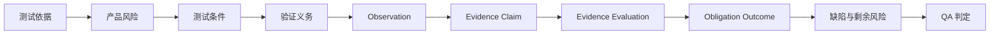

# Traceknot

<!-- readme-section:hero -->

<p align="center">
  
</p>

<p align="center"><strong>面向编码智能体的可审计 QA。</strong></p>

<p align="center">
  将测试依据、产品风险和运行时证据连接为可追溯、确定性的 QA 判定。
</p>

<p align="center">
  <a href="README.md">English</a> ·
  <a href="README.ko.md">한국어</a> ·
  <a href="README.zh.md">简体中文</a>
</p>

<p align="center">
  <a href="https://github.com/Jin-Doh/traceknot/actions/workflows/ci.yml"></a>
  <a href="https://github.com/Jin-Doh/traceknot/releases"></a>
  <a href="LICENSE"></a>
</p>

<p align="center">
  <a href="https://traceknot.kyungho.info">网站</a> ·
  <a href="BRAND.md">品牌规范</a>
</p>

Traceknot 是一个面向 OMP、Codex、Claude Code、OpenCode 和 GajaeCode 等编码智能体运行框架的 ISTQB 对齐 QA 框架。可移植 Skill 定义测试流程；可选的宿主中立核心验证规范记录并解析判定。

Traceknot 不编排智能体。模型、任务图、并发、重试、worktree、生命周期和最终交付仍由宿主负责。Traceknot 负责回答 QA 问题：必须验证什么、哪些证据可以接受、还剩下什么风险，以及这些事实应当产生什么判定。

Proof-carrying success 将四个层次明确分开：Observation 记录事实，Evidence Claim 解释这些事实如何支持某项义务，Evidence Evaluation 接受或拒绝该 claim，Obligation Outcome 记录结果。只有绑定到目标快照并已被接受的正向证据，才能满足强制标准。

> `QA PASS` 表示声明的测试依据和强制验证义务已经通过。它不表示所有智能体、任务、job 或交付都已完成。

<!-- readme-section:quick-start -->

## 快速开始

使用 Node.js 22.20 或更高版本安装可移植 Skill：

<!-- shared-command:skill-install -->

```sh
npx skills add Jin-Doh/traceknot --skill traceknot --global
```

安装后，让编码智能体把 Traceknot 应用于一项具体变更：

```text
请使用 Traceknot 验证这项变更。分别报告测试依据、风险、
强制验证义务、已观察证据、缺陷、剩余风险和最终 QA 判定，
不要把 QA 判定与任务完成状态混为一谈。
```

该 Skill 可独立运行。即使不安装可选的 TypeScript 核心，也可以执行完整的 evidence-only 工作流。

<!-- readme-section:why -->

## 为什么需要 Traceknot

编码智能体运行框架已经能够报告活动状态，但“发生了活动”并不等同于 QA 判定。

| 原生信号 | 仅凭该信号无法证明的内容 |
|---|---|
| 任务或智能体停止 | 强制验证是否通过 |
| 命令成功退出 | 测试依据和风险覆盖是否充分 |
| 智能体报告完成 | 证据是否最新、独立并绑定到目标快照 |
| 已观察 job 进入 idle 状态 | 是否仍有未观察到的工作 |
| 生命周期 hook 触发 | 是否形成确定性 QA 判定或完成权限 |

Traceknot 补上缺失的测试流程层。它把声明的依据、风险、条件、义务、证据、缺陷和剩余风险连接起来，使相同输入得到相同判定。

<!-- readme-section:outputs -->

## 你会得到什么

- 从需求、契约、仓库策略和验收标准中整理出的测试依据
- 每次运行都会执行的 trigger scan，以及只在风险需要时执行的 bounded challenge
- 可观察的测试条件和强制验证义务
- 绑定到目标快照、证据生产者和验证义务的证据
- 可以分别检查的 proof-carrying observation、claim、evaluation 和 outcome
- 不会把缺失证据转换为 PASS 的缺陷与剩余风险处理
- 按明确优先级计算的确定性判定

完成报告大致会呈现以下信息：

```text
Verdict             PASS_WITH_ACCEPTED_RISK
Snapshot            8f3c2a1
Mandatory checks    7 / 7 passed
Evidence            snapshot-bound
Residual risk       1 accepted, with owner and expiry
Harness authority   false
```

以上内容仅用于说明，不替代规范 JSON record，也不代表一次真实运行的观察结果。

<!-- readme-section:process -->

## 工作方式



每次运行都会在最终风险分级之前执行一次轻量 trigger scan。只有当变更存在实质风险、范围仍不明确、当前证据绕过了已变更契约，或变更涉及重复缺陷集群时，才会执行 bounded adversarial challenge。

最终判定遵循以下优先级：

```text
FAIL → BLOCKED → INCOMPLETE → PASS_WITH_ACCEPTED_RISK → PASS
```

Traceknot 适用于实现验证、缺陷修复确认、发布检查、仓库审计、证据审查和剩余风险决策。完整的测试技术、discovery 规则、可追溯模型和完成报告契约请参阅 [QA 流程](docs/qa-process.md)。

<!-- readme-section:status -->

## 当前可用范围

| 能力 | 状态与边界 |
|---|---|
| 可移植、ISTQB 对齐的 Skill | **可用。** Evidence-only 工作流，不依赖核心 |
| 规范 QA record schema | **可用。** 封闭的 JSON Schema Draft 2020-12 契约 |
| Proof-carrying evidence record | **可用。** Observation、claim、evaluation、success criterion、traceability 和 verification run 契约 |
| 宿主中立 verdict core | **可用。** 始终输出 `authoritative: false` |
| Capability manifest | **可用。** 静态 manifest 采用保守声明，不授予运行时能力 |
| 用户本地完整 Toolkit installer 和 updater | **可用。** 验证 GitHub release artifact、digest 和 provenance |
| OMP、Codex、Claude Code、OpenCode 或 GajaeCode 原生 adapter | **尚未实现。** 仅凭宿主名称不会获得 capability |
| 运行框架完成权限 | **默认禁用。** 可选 extension，`phase1Authorized: false` |
| npm package 或专用 Skill registry 条目 | **暂不提供。** 可以通过 Skills CLI 直接从 GitHub 安装 |

可移植 Skill 和宿主中立核心现在即可使用。对运行框架完成状态作出权威声明仍属于单独的集成项目。

<!-- readme-section:install -->

## 安装方式

### 可移植 Skill — 推荐

快速开始命令会通过 Skills CLI 安装 `skill/SKILL.md` 及其参考资料。只为 Codex 安装时添加 `--agent codex`；只在当前项目中安装时省略 `--global`。

查询、更新和删除也使用同一个 CLI：

```sh
npx skills list --global
npx skills update traceknot --global --yes
npx skills remove traceknot --global --yes
```

### 完整 Toolkit — 高级

当你还需要 schema、capability manifest、宿主中立核心和经过验证的 release updater 时，安装完整 Toolkit：

<!-- shared-command:full-toolkit-install -->

```sh
curl -fsSL https://raw.githubusercontent.com/Jin-Doh/traceknot/main/install.sh | sh
```

在受控环境中运行前，请先检查脚本或固定到具体 tag。Installer 无需 `sudo`，支持 `--dry-run`，默认安装到 `${XDG_DATA_HOME:-$HOME/.local/share}/traceknot`。

请将 bootstrap 脚本和下载的 payload 同时固定到同一个 tag 或 commit：

<!-- shared-command:full-toolkit-pinned-install -->

```sh
TRACEKNOT_REF=<tag-or-commit>
curl -fsSL "https://raw.githubusercontent.com/Jin-Doh/traceknot/$TRACEKNOT_REF/install.sh" \
  | TRACEKNOT_REF="$TRACEKNOT_REF" sh
```

Skills CLI 和完整 Toolkit installer 管理同一份用户本地 Skill 注册。切换安装方式前应先删除现有安装。资格判定、验证、rollback 和 opt-out 行为请参阅[自动更新](docs/automatic-updates.md)。

使用以下命令删除默认路径中的完整 Toolkit：

<!-- shared-command:full-toolkit-uninstall -->

```sh
curl -fsSL https://raw.githubusercontent.com/Jin-Doh/traceknot/main/uninstall.sh | sh
```

如果使用自定义安装路径，请在 `sh` 后附加 `-s -- --prefix /absolute/path`。

如果安装时还使用了自定义 Skills root，请把同一个值传给 uninstaller：

<!-- shared-command:full-toolkit-custom-uninstall -->

```sh
curl -fsSL https://raw.githubusercontent.com/Jin-Doh/traceknot/main/uninstall.sh \
  | TRACEKNOT_SKILLS_ROOT=/absolute/skills sh -s -- --prefix /absolute/path
```

包含当前 layout 与 legacy layout 路径选择逻辑的 updater 可执行命令，请参阅[自动更新](docs/automatic-updates.md)。

<!-- readme-section:documentation -->

## 文档

| 主题 | 文档 |
|---|---|
| 测试流程、风险发现、判定和可追溯性 | [QA 流程](docs/qa-process.md) |
| Observation → Claim → Evaluation → Outcome 的规范语义 | [Proof-carrying success](skill/references/proof-carrying-success.md) |
| 组件、职责、adapter 和仓库结构 | [架构](docs/architecture.md) |
| 证据、capability、权限和安全边界 | [信任模型](docs/trust-model.md) |
| 翻译责任和同步规则 | [本地化](docs/localization.md) |
| 完整 Toolkit updater 策略和恢复 | [自动更新](docs/automatic-updates.md) |
| 安全分析和剩余风险 | [安全分析](docs/security-analysis.md) |
| 可执行的 portable workflow | [Skill 规范](skill/SKILL.md) |
| 命名、文案、配色和视觉资产 | [品牌规范](BRAND.md) |

<!-- readme-section:development -->

## 开发

核心开发需要 Bun 1.3.14。请在不执行 lifecycle script 的情况下安装经过审查的 dependency graph，然后运行与 GitHub Actions 相同的 canonical gate：

<!-- shared-command:ci -->

```sh
bun install --frozen-lockfile --ignore-scripts
bun run ci
```

该 gate 会验证 installer lifecycle、schema、capability record、prompt-injection 风险、发布文案、测试、strict TypeScript 和 whitespace 完整性。`bun run prose-quality` 会为韩文、英文以及显式映射的简体中文发布文案生成 advisory report；它不会根据汉字自动推断 locale，也不会把其他语言套用到错误的规则上。

安全相关 finding 应包含明确的预期结果、观察结果、复现方法、目标 snapshot 和剩余风险。智能体自己的完成声明不能作为验证证据。

## 许可证

Traceknot 使用 [MIT License](LICENSE) 发布。
