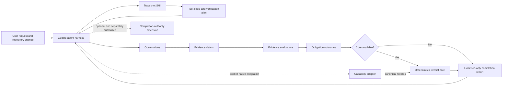

# Traceknot architecture

Traceknot separates portable test-process guidance, deterministic QA decisions, and optional harness completion authority. That separation keeps the ordinary Skill usable without granting it control over agents or host lifecycle.

## System boundary



The Skill declares what must be verified and which evidence is sufficient. The harness decides how to execute work. The core validates records and resolves a verdict. None of those portable surfaces establish global harness completion.

## Responsibility split

| Harness owns | Traceknot owns |
|---|---|
| Agents and models | Test basis and product risks |
| Task graph and concurrency | Test conditions and verification obligations |
| Retry and cancellation | Evidence requirements and traceability |
| Worktrees, jobs, and deliveries | Defects and residual risk |
| Harness lifecycle and completion | QA verdict and completion report |

Lifecycle events are observations. A task ending, queue becoming idle, or hook firing does not independently establish QA coverage or completion authority.

## Components

### Traceknot Skill

`skill/` contains the portable ISTQB-aligned workflow. It covers test basis, risk classification, universal trigger scanning, bounded adversarial discovery, test design, entry and exit criteria, evidence, defect lifecycle, traceability, residual risk, and completion reporting.

The portable Skill is a closed Markdown artifact. Its artifact boundary is checked by `bun scripts/check-skill-egress.ts`; the checker rejects executable files, symlinks, special filesystem entries, and paths outside the approved Skill tree. This is a static supply-chain boundary, not a runtime network sandbox.

The Skill has no runtime dependency on `system/`. Installation through the Skills CLI is sufficient for the evidence-only workflow.

### Traceknot records

`contracts/` contains closed JSON Schema Draft 2020-12 records for:

- host capabilities;
- verification requests and plans;
- observations, evidence claims, and evidence evaluations;
- success criteria, traceability links, and verification runs;
- evidence and defects;
- QA verdicts;
- optional risk-discovery reports;
- release and update metadata.

The preserved `quality-capability/v1` schema remains valid for existing records. New static adapter records use `quality-capability/v2`, which requires every host-neutral capability boolean, including isolated read-only review and enforced structured output.

### Traceknot Core

`system/core/` contains the host-neutral TypeScript resolvers. `resolveProofCarryingQaVerdict` accepts a mandatory result only through the proof-carrying chain Observation → Evidence Claim → Evidence Evaluation → Obligation Outcome. It rejects or fails closed on unsupported claims, missing structured actual values, cross-snapshot evidence, inadequate producer independence, incomplete traceability, open material defects, and expired risk acceptance.

`resolveQaVerdict` remains a legacy compatibility path for callers that provide `ObligationResult` values without the proof-carrying records. It preserves the older verdict behavior and must not be presented as proof-carrying enforcement. Integrators that require the evidence-record guarantees above must call `resolveProofCarryingQaVerdict`.

The core always emits `authoritative: false`. It does not orchestrate reviewers, prove global quiescence, or enforce harness completion.

### Capability adapters

`adapters/` contains conservative static manifests for supported harness names. Every default capability is `false`. A real runtime adapter must provide a current, evidence-backed capability handshake without taking over the host's orchestration policy.

A host or model name grants no capability. Profile selection follows the handshake, not branding.

The Codex adapter exposes a capability-record discovery primitive, not a native Codex transport. Without a handshake it loads the checked-in all-false manifest. For each discovery the adapter creates a non-repeating challenge. A trusted native integration may answer with an envelope bound to the host, session, snapshot, producer, challenge, validity window, explicit maximum lifetime, and capability ceiling. The portable adapter rejects mismatched, stale, replayed, malformed, overlong, or over-privileged envelopes.

The `enforceSkillOriginEgressDeny` capability is conservative: every checked-in adapter advertises `false` until a host mediator can attribute a request to Skill execution, deny it before transmission, and preserve snapshot-bound evidence. Capability discovery alone never supplies the mediator.

The Claude Code adapter uses the same canonical envelope and rejection semantics with a distinct `claude-code` host boundary. Hook events such as `Stop`, `TaskCompleted`, or `SubagentStop` remain observations and cannot stand in for a trusted producer or accepted evidence.

### Independent execution completion

The local Verify CLI collector is never promoted to `independent-producer` merely because a manifest supplies an oracle file. Independent command or browser results cross a separate trust boundary: an external producer emits a canonical `verification-execution-completion/v1` envelope, and the manifest identifies it with `executionCompletionPath`. The envelope binds the request, plan, obligation, snapshot, idempotency key, producer, execution result, artifacts, and UI oracle digests. `executionCompletionArtifacts` maps that signed artifact set to absolute handoff files outside the Git root. After authenticating the envelope, the CLI securely reads each file, verifies its digest and type, and publishes it into the run's content-addressed artifact store; duplicates, omissions, extras, and unavailable bytes are rejected.

The CLI authenticates that binding with Ed25519 against the administrator-installed `/etc/traceknot/trusted-producer.json` policy. The policy is accepted only as a root-owned regular file without group or world write permission, and its key identifier must equal the SHA-256 digest of the configured public key. Imported completions are persisted under the same generation-fenced dispatch claim as local results, so crash replay cannot rerun the producer or substitute a later envelope. Missing policy, invalid signature, binding drift, and provider failure all fail closed; a failed import releases the live claim instead of leaving a false completed result.

### Assurance context

The Verify CLI carries an explicit `assuranceContext`: `local` for development verification and `release` for a release gate. The default is `release`; request, report, and Board projections preserve the selected value. Plan construction is anti-escalatory: local UI composition and resilience obligations require a separate verification context, while release UI obligations require an independent producer. A local run is never represented as release-satisfied, and a release report is satisfied only by a passing terminal verdict.

### GitHub governance

The root composite `action.yml` supports self-hosting and explicit request/manifest modes. Both modes retain their report; manifest mode also retains durable state and content-addressed artifacts even when verification fails. The governed workflow publishes separate lifecycle and verdict jobs plus an `always()` aggregate job suitable for branch protection; a missing, cancelled, blocked, incomplete, or failed verdict cannot satisfy that aggregate.

Manifest-mode request, manifest, and optional SARIF inputs are copied directly from one immutable commit resolved from the caller's checked-out `HEAD`; filesystem traversal, symlink substitution, ref movement, and post-validation source swaps cannot change or mix their bytes. The CLI internally requires the snapshot it captures for verification to have that same HEAD and a clean worktree, so configuration from one commit cannot govern another snapshot. Self-hosting mode runs against the checked-out caller Traceknot repository, including when the action implementation is loaded from a remote action archive. Every invocation receives a securely allocated evidence directory and unique artifact name. Optional tracked SARIF is uploaded only when a caller supplies its path and grants `security-events: write` to the job. The self-hosting workflow does neither. Traceknot does not relabel source candidates as confirmed defects, and the GitHub Action does not acquire completion authority.

### Release-readiness gates

The deterministic `traceknot-1.0/v1` suite hard-gates nine proof-carrying verdict cases, all ten cache-key boundaries, cold/warm payload parity, relevant-context semantics, cache integrity rejection, and honest unavailable provider usage. Its closed machine report contains no timing, host, or random fields and is byte-stable across fresh cache roots.

The token-accounting gate rejects fabricated zero values when no provider observation exists and records provider efficiency as `NOT_EVALUATED`. The suite therefore proves resolver, cache, and accounting conformance—not agent quality, avoided work, provider cache effectiveness, token reduction, or cost savings. See [Release-readiness benchmark](release-readiness.md).

### Completion-authority extension

`system/extensions/harness-completion-authority/` preserves the optional lifecycle, quiescence, lease, receipt, terminal-pair, SQLite, schema, and generated-evidence contracts.

The extension is disabled by policy and reports `phase1Authorized: false`. Activating it requires an explicit native integration and a separate authorization process. Ordinary Skill or core use never enables it.

## Repository layout

```text
.
├── README.md
├── README.ko.md
├── README.zh.md
├── assets/
│   ├── traceknot-mark.svg
│   └── readme/
│       └── traceknot-hero.webp
├── skill/
│   ├── SKILL.md
│   └── references/
├── contracts/
├── benchmarks/
├── adapters/
├── system/
│   ├── benchmarks/
│   ├── core/
│   └── extensions/
├── scripts/
├── tests/
└── docs/
```

## Design constraints

- Evidence must bind to the target snapshot and obligation.
- Observations, claims, evaluations, and outcomes must remain distinguishable.
- A mandatory PASS requires accepted positive evidence for its success criterion.
- Required producer independence cannot be silently downgraded.
- A missing, cancelled, timed-out, or incomplete mandatory result is never PASS.
- Discovery findings distinguish missing coverage, source candidates, and confirmed defects.
- Risk acceptance requires an accountable owner, reason, mitigation, evidence, and expiry.
- Portable verdicts remain non-authoritative with respect to harness completion.

See the [QA process](qa-process.md) for execution semantics and the [trust model](trust-model.md) for evidence and authority boundaries.
