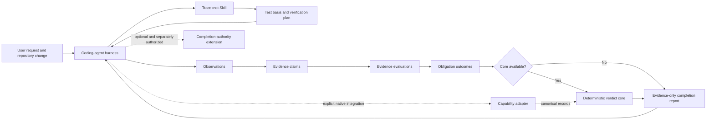

# Traceknot architecture

Traceknot separates portable test-process guidance, deterministic QA decisions, and optional harness completion authority. That separation keeps the ordinary Skill usable without granting it control over agents or host lifecycle.

## System boundary



The Skill declares what must be verified and which evidence is sufficient. The harness decides how to execute work. The core validates records and resolves a verdict. None of those portable surfaces establish global harness completion.

## Responsibility split

| Harness owns | Traceknot owns |
|---|---|
| Agents and models | Test basis and product risks |
| Task graph and concurrency | Test conditions and verification obligations |
| Retry and cancellation | Evidence requirements and traceability |
| Worktrees, jobs, and deliveries | Defects and residual risk |
| Harness lifecycle and completion | QA verdict and completion report |

Lifecycle events are observations. A task ending, queue becoming idle, or hook firing does not independently establish QA coverage or completion authority.

## Components

### Traceknot Skill

`skill/` contains the portable ISTQB-aligned workflow. It covers test basis, risk classification, universal trigger scanning, bounded adversarial discovery, test design, entry and exit criteria, evidence, defect lifecycle, traceability, residual risk, and completion reporting.

The Skill has no runtime dependency on `system/`. Installation through the Skills CLI is sufficient for the evidence-only workflow.

### Traceknot records

`contracts/` contains closed JSON Schema Draft 2020-12 records for:

- host capabilities;
- verification requests and plans;
- observations, evidence claims, and evidence evaluations;
- success criteria, traceability links, and verification runs;
- evidence and defects;
- QA verdicts;
- optional risk-discovery reports;
- release and update metadata.

The preserved `quality-capability/v1` schema remains valid for existing records. New static adapter records use `quality-capability/v2`, which requires every host-neutral capability boolean, including isolated read-only review and enforced structured output.

### Traceknot Core

`system/core/` contains the host-neutral TypeScript resolvers. `resolveProofCarryingQaVerdict` accepts a mandatory result only through the proof-carrying chain Observation → Evidence Claim → Evidence Evaluation → Obligation Outcome. It rejects or fails closed on unsupported claims, missing structured actual values, cross-snapshot evidence, inadequate producer independence, incomplete traceability, open material defects, and expired risk acceptance.

`resolveQaVerdict` remains a legacy compatibility path for callers that provide `ObligationResult` values without the proof-carrying records. It preserves the older verdict behavior and must not be presented as proof-carrying enforcement. Integrators that require the evidence-record guarantees above must call `resolveProofCarryingQaVerdict`.

The core always emits `authoritative: false`. It does not orchestrate reviewers, prove global quiescence, or enforce harness completion.

### Capability adapters

`adapters/` contains conservative static manifests for supported harness names. Every default capability is `false`. A real runtime adapter must provide a current, evidence-backed capability handshake without taking over the host's orchestration policy.

A host or model name grants no capability. Profile selection follows the handshake, not branding.

The Codex adapter exposes a capability-record discovery primitive, not a native Codex transport. Without a handshake it loads the checked-in all-false manifest. For each discovery the adapter creates a non-repeating challenge. A trusted native integration may answer with an envelope bound to the host, session, snapshot, producer, challenge, validity window, explicit maximum lifetime, and capability ceiling. The portable adapter rejects mismatched, stale, replayed, malformed, overlong, or over-privileged envelopes.

### Completion-authority extension

`system/extensions/harness-completion-authority/` preserves the optional lifecycle, quiescence, lease, receipt, terminal-pair, SQLite, schema, and generated-evidence contracts.

The extension is disabled by policy and reports `phase1Authorized: false`. Activating it requires an explicit native integration and a separate authorization process. Ordinary Skill or core use never enables it.

## Repository layout

```text
.
├── README.md
├── README.ko.md
├── README.zh.md
├── assets/
│   ├── traceknot-mark.svg
│   └── readme/
│       └── traceknot-hero.webp
├── skill/
│   ├── SKILL.md
│   └── references/
├── contracts/
├── adapters/
├── system/
│   ├── core/
│   └── extensions/
├── scripts/
├── tests/
└── docs/
```

## Design constraints

- Evidence must bind to the target snapshot and obligation.
- Observations, claims, evaluations, and outcomes must remain distinguishable.
- A mandatory PASS requires accepted positive evidence for its success criterion.
- Required producer independence cannot be silently downgraded.
- A missing, cancelled, timed-out, or incomplete mandatory result is never PASS.
- Discovery findings distinguish missing coverage, source candidates, and confirmed defects.
- Risk acceptance requires an accountable owner, reason, mitigation, evidence, and expiry.
- Portable verdicts remain non-authoritative with respect to harness completion.

See the [QA process](qa-process.md) for execution semantics and the [trust model](trust-model.md) for evidence and authority boundaries.
